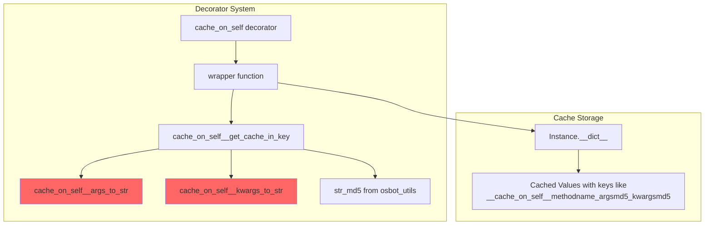
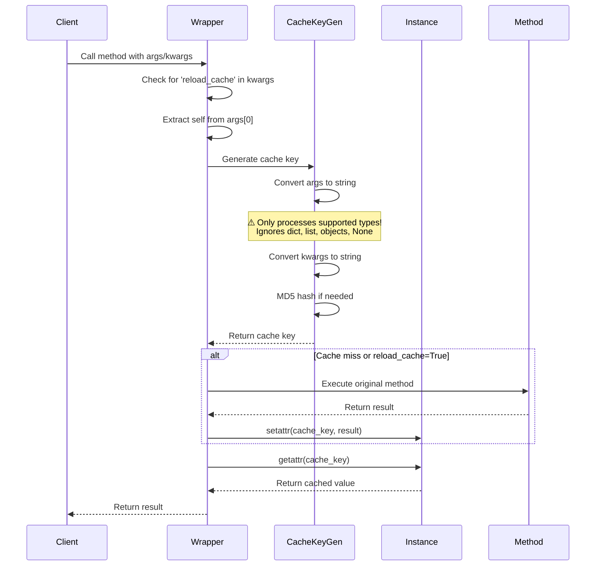
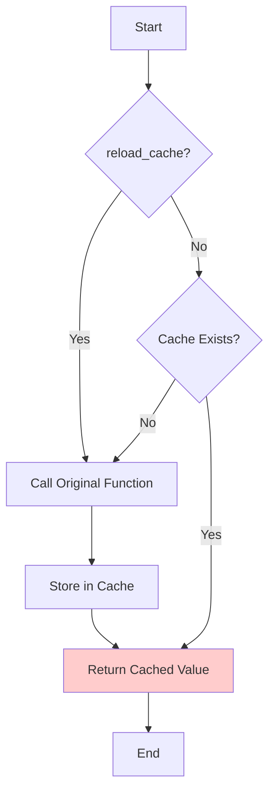

# Technical Debrief: @cache_on_self Decorator

## Overview

The `@cache_on_self` decorator implements a per-instance caching mechanism for class methods. Unlike global caching solutions, this decorator stores cached results as attributes directly on the class instance, making the cache lifetime tied to the object's lifetime.

**⚠️ CRITICAL WARNING**: This decorator has severe bugs that make it unsafe for most use cases. See the "Critical Bugs" section.

## Architecture Components

### Core Components



### Data Flow



## Detailed Component Analysis

### 1. Main Decorator Function

```python
def cache_on_self(function: T) -> T:
   ...
```

**Purpose**: Entry point that wraps the target method with caching logic.

**Key Features**:
- Uses `functools.wraps` to preserve function metadata
- Returns a wrapper that maintains the same type signature (TypeVar `T`)
- Imports are done inside the function (lazy loading)

### 2. Wrapper Function Logic

**Input Validation**:
- Checks that args is not empty
- Validates that args[0] is a class instance (not a class itself)
- Raises exception if self cannot be found

**Cache Control**:
- Checks for `reload_cache` parameter in kwargs
- Only reloads if explicitly set to `True`
- Removes `reload_cache` from kwargs before calling original function

**Cache Operations**:


### 3. Cache Key Generation

**Function**: `cache_on_self__get_cache_in_key`

**Process**:
1. Extract function name
2. Convert args to string (excluding self)
3. Convert kwargs to string
4. MD5 hash the strings if they exist
5. Combine into format: `__cache_on_self___{function_name}_{args_md5}_{kwargs_md5}`

**Key Structure Examples**:
- No args/kwargs: `__cache_on_self___an_function__`
- With args: `__cache_on_self___echo_698d51a19d8a121ce581499d7b701668_`
- With kwargs: `__cache_on_self___method__8b1a9953c4611296a827abf8c47804d7`

### 4. Argument Serialization

**Supported Types** (`CACHE_ON_SELF_TYPES`):
- Primitives: `int`, `float`, `bool`, `complex`, `str`
- Binary: `bytes`, `bytearray`

**Not Supported** (silently ignored):
- Collections: `list`, `dict`, `set`, `tuple`
- Objects (any custom class instances)
- `None` values
- Functions/callables

**Serialization Strategy**:
- Args: Concatenated string of all supported type values (no delimiters!)
- Kwargs: Format `key:value|` for each supported type
- **⚠️ Non-supported types are skipped entirely with no warning**

**Serialization Examples**:
```python
# Args serialization (note: no delimiters between values!)
cache_on_self__args_to_str(('a', 1, 1.0)) == "a11.0"
cache_on_self__args_to_str(('a', None, 'bbb', [], {})) == "abbb"  # None, [], {} ignored
cache_on_self__args_to_str((1, -1)) == "1-1"  # Could be ambiguous!

# Kwargs serialization
cache_on_self__kwargs_to_str({"an": "value"}) == 'an:value|'
cache_on_self__kwargs_to_str({"a": "b", "c": "d"}) == 'a:b|c:d|'
cache_on_self__kwargs_to_str({"an": None}) == ''  # None values ignored
```

**Potential String Collision Issue**: Args are concatenated without delimiters, which can cause cache collisions:
- `method(1, 23)` → "123"
- `method(12, 3)` → "123"
- `method(123)` → "123"
All three calls would share the same cache!

## 🚨 Critical Bugs

### 1. Complete Cache Collision for Unsupported Types

When a method accepts unsupported argument types (dict, list, set, objects, None), ALL calls to that method return the first cached result, regardless of the actual arguments passed.

**Example of the bug**:
```python
@cache_on_self
def process_dict(self, data):
    return f"processed: {data.get('key', 'no-key')}"

obj = Test_Class()
result1 = obj.process_dict({'key': 'value1'})  # Returns: "processed: value1"
result2 = obj.process_dict({'key': 'value2'})  # BUG: Returns: "processed: value1"
result3 = obj.process_dict({'foo': 'bar'})     # BUG: Returns: "processed: value1"
```

### 2. Silent Failure Mode

The decorator provides no warning or error when:
- Arguments are unsupported types
- Cache collisions will occur
- The caching behavior will be incorrect

### 3. Mutation Blindness

Even for supported types, the cache doesn't detect mutations:
```python
data = {'key': 'value1'}
result1 = obj.method(data)  # Cached
data['key'] = 'value2'      # Mutation ignored
result2 = obj.method(data)  # Returns stale cached result
```

### 5. Test Case Demonstrating Complete Failure

```python
class Test_Class:
    @cache_on_self
    def process(self, data):
        return f"processing: {repr(data)}"

obj = Test_Class()

# All these different calls share the SAME cache entry!
result_1 = obj.process({'a': 1})           # First call - cached
result_2 = obj.process({'b': 2, 'c': 3})   # Returns: "processing: {'a': 1}"
result_3 = obj.process([1, 2, 3])          # Returns: "processing: {'a': 1}"
result_4 = obj.process(None)               # Returns: "processing: {'a': 1}"
result_5 = obj.process(obj)                # Returns: "processing: {'a': 1}"

# Only ONE cache key exists for all these calls
assert obj.__cache_on_self___process__ == "processing: {'a': 1}"
```

### 6. Direct Cache Manipulation

The cache is stored as a regular instance attribute, making it vulnerable to accidental or intentional manipulation:

```python
an_class = An_Class()
assert an_class.an_function() == 42

# Direct access to cache is possible
assert an_class.__cache_on_self___an_function__ == 42

# Cache can be modified directly!
an_class.__cache_on_self___an_function__ = 12
assert an_class.an_function() == 12  # Now returns corrupted value
```

### 7. Reload Cache Behavior

The `reload_cache` parameter provides a way to force cache refresh:

```python
@cache_on_self
def an_function(self):
    self.counter += 1
    return self.counter

obj.an_function()                  # Returns: 1 (cached)
obj.an_function()                  # Returns: 1 (from cache)
obj.an_function(reload_cache=True) # Returns: 2 (forced refresh)
obj.an_function()                  # Returns: 2 (new cached value)
```

Note: `reload_cache=False` does NOT prevent reload - only `True` forces it.

## Performance Characteristics

### Overhead Per Call


**Measured Performance Impact**:
- Simple function without cache: ~0.1μs per call
- Same function with @cache_on_self: ~1-2μs per call
- **Overhead ratio: 20-40x slowdown**

**Constant Overhead Operations**:
1. Wrapper function call
2. Parameter validation
3. `reload_cache` check and deletion
4. Key generation (even for no args)
5. `hasattr()` check
6. `getattr()` retrieval

### Memory Usage

- Each cached value stored as instance attribute
- Key names can be long (function name + 2 MD5 hashes)
- No cache eviction policy - grows indefinitely
- Cache lifetime = instance lifetime

## Behavioral Characteristics

### When It Works Correctly

The decorator ONLY works correctly for methods that:
1. Take no arguments, OR
2. Only take arguments of supported primitive types (int, float, str, bool, bytes, bytearray, complex)

### When It Fails Silently

The decorator fails catastrophically for methods that accept:
- Dictionaries
- Lists, tuples, sets
- Custom objects
- None values
- Any combination of supported and unsupported types

### Cache Invalidation
- Manual only via `reload_cache=True`
- No automatic invalidation
- No TTL/expiration
- No size limits

## Summary of Issues

| Issue | Severity | Impact |
|-------|----------|---------|
| Cache collision for unsupported types | 🔴 Critical | Wrong results returned |
| No warnings for unsupported types | 🔴 Critical | Silent failures |
| String concatenation collisions | 🔴 Critical | Different args → same cache |
| High performance overhead (20-40x) | 🟡 Medium | Significant slowdown |
| No cache management | 🟡 Medium | Memory growth |
| Ignores mutations | 🟡 Medium | Stale data |
| Direct cache manipulation possible | 🟟 Low | Cache corruption risk |

## Recommendations

1. **DO NOT USE** this decorator for methods that accept:
   - Collections (dict, list, set, tuple)
   - Custom objects
   - None values
   - Mixed argument types

2. **ONLY USE** for methods that:
   - Have no arguments
   - Only accept primitive types (int, str, float, etc.)
   - Are called infrequently enough that 20-40x overhead is acceptable

3. **Consider alternatives**:
   - `functools.lru_cache` for function-level caching
   - Custom caching with proper key generation
   - Third-party caching libraries with better type support

## Edge Cases and Additional Findings

### Mixed Type Arguments

When methods have both supported and unsupported types, only the supported types contribute to the cache key:

```python
@cache_on_self
def echo_args(self, *args):
    return args

# These calls demonstrate which arguments are considered
obj.echo_args('a', None, 'bbb', [], {})  
# Cache key uses: "abbb" (None, [], {} ignored)

obj.echo_args('a', -1, ['a'], {'b': None})  
# Cache key uses: "a-1" (list and dict ignored)
```

### Cache Key Inspection

The tests show how to inspect the actual cache keys and values:

```python
# Get all cache keys for an instance
cache_keys = [k for k in obj.__dict__.keys() if k.startswith('__cache_on_self__')]

# Example cache keys from tests:
# '__cache_on_self___an_function__'                          # No args
# '__cache_on_self___echo_698d51a19d8a121ce581499d7b701668_' # With args (MD5 hash)
# '__cache_on_self___echo_value:111|_9725ca64521455c69344862a352e3adc' # With kwargs
```

### Instance Isolation

Cache is properly isolated between instances:

```python
an_class_1 = An_Class()
an_class_2 = An_Class()

an_class_1.__cache_on_self___an_function__ = 12
assert an_class_1.an_function() == 12
assert an_class_2.an_function() == 42  # Different instance, different cache
```