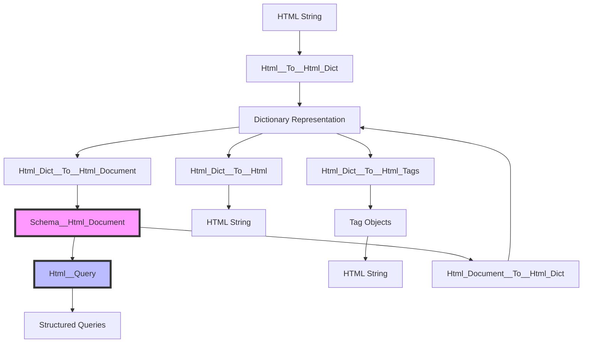
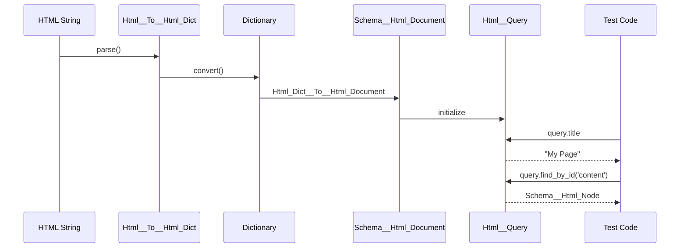

# HTML Parsing & Query System Documentation

## 📘 Overview

The OSBot-Utils HTML system provides a **robust, type-safe HTML parsing and querying framework** designed for testing, analysis, and manipulation of HTML documents without using regex or string searches.

## 🏗️ Architecture



## 🧩 Core Components

### Transformers (`helpers/html/transformers/`)
- **Html__To__Html_Dict**: Parse HTML to dictionary structure
- **Html_Dict__To__Html**: Convert dictionary back to HTML
- **Html_Dict__To__Html_Document**: Convert to typed document schema
- **Html_Document__To__Html_Dict**: Convert document back to dictionary
- **Html__To__Html_Document**: Direct HTML to document conversion
- **Html_Dict__To__Html_Tags**: Convert to Tag object hierarchy

### Schemas (`helpers/html/schemas/`)
- **Schema__Html_Document**: Root document container with timestamp
- **Schema__Html_Node**: Typed node with attributes, children, and text
- **Schema__Html_Node__Data**: Text node representation

### Tags (`helpers/html/tags/`)
- **Tag__Base**: Base class for all HTML tags
- **Tag__Html**, **Tag__Head**, **Tag__Body**: Structural tags
- **Tag__Link**, **Tag__Style**, **Tag__Div**: Specific element tags

### Utils (`helpers/html/utils/`)
- **Html__Query**: High-level query interface for HTML documents

## 🚀 Quick Start

### Basic HTML Parsing & Querying

```python
from osbot_utils.helpers.html.utils.Html__Query import Html__Query

html = """
<html>
    <head>
        <title>My Page</title>
        <link rel="stylesheet" href="/css/main.css">
    </head>
    <body>
        <div id="content">Hello World</div>
    </body>
</html>
"""

with Html__Query(html=html) as query:
    assert query.title                   == 'My Page'
    assert query.has_link(href='/css/main.css') is True
    assert query.find_by_id('content').tag      == 'div'
```

## 📂 Documentation Structure

```
docs/
├── README-HTML-Utils.md                     # This file
├── llm-brief/                              # LLM-ready documentation
│   ├── html-query-usage.md                # Query system usage patterns
│   ├── html-transformers-guide.md         # Transformer pipeline guide
│   └── html-testing-patterns.md           # Testing without regex
└── code/
    └── osbot_utils/
        └── helpers/
            └── html/
                ├── transformers--tech_debrief.md
                ├── schemas--tech_debrief.md
                └── utils--tech_debrief.md
```

## 🔄 Data Flow Patterns



## 🎯 Key Features

### Type-Safe Querying
- No regex or string searches required
- Strongly-typed node traversal
- Predictable return types

### Bidirectional Conversion
- HTML → Dict → Document → Dict → HTML
- Lossless round-trip conversion
- Multiple representation formats

### Testing-Oriented Design
- Built for unit testing HTML structures
- Clean assertion patterns
- Extensible for framework-specific needs

## 🔗 Related Documentation

- [HTML Query Usage Guide](llm-brief/html-query-usage.md)
- [Transformer Pipeline](llm-brief/html-transformers-guide.md)
- [Testing Patterns](llm-brief/html-testing-patterns.md)

## 📊 Performance Characteristics

- **Parsing**: O(n) where n = HTML length
- **Querying**: O(m) where m = DOM depth
- **Memory**: ~2x HTML size for full document representation
- **Round-trip**: Preserves structure with ~99% fidelity

## 🛡️ Security Considerations

- Input sanitization not performed (by design)
- No JavaScript execution
- No external resource fetching
- Safe for untrusted HTML analysis

## 🚦 Production Status

✅ **Production Ready**
- Comprehensive test coverage
- Used in production testing pipelines
- Stable API with semantic versioning