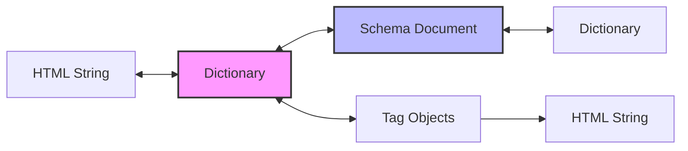

# HTML Transformers Pipeline Guide

## 🎯 Purpose

The HTML Transformers provide **bidirectional conversion** between HTML strings, dictionary representations, typed documents, and tag objects.

## 🔄 Transformation Pipeline



## 📦 Core Transformers

### 1. Html__To__Html_Dict

**Purpose**: Parse HTML string to dictionary structure

```python
from osbot_utils.helpers.html.transformers.Html__To__Html_Dict import Html__To__Html_Dict

html = "<div class='container'><p>Hello</p></div>"
parser = Html__To__Html_Dict(html)
html_dict = parser.convert()

# Result structure:
# {
#     'tag': 'div',
#     'attrs': {'class': 'container'},
#     'nodes': [
#         {
#             'tag': 'p',
#             'attrs': {},
#             'nodes': [{'type': 'TEXT', 'data': 'Hello'}]
#         }
#     ]
# }
```

### 2. Html_Dict__To__Html

**Purpose**: Convert dictionary back to HTML string

```python
from osbot_utils.helpers.html.transformers.Html_Dict__To__Html import Html_Dict__To__Html

html_dict = {
    'tag': 'div',
    'attrs': {'id': 'main'},
    'nodes': [{'type': 'TEXT', 'data': 'Content'}]
}

converter = Html_Dict__To__Html(html_dict)
html = converter.convert()
# Result: <div id="main">Content</div>
```

### 3. Html_Dict__To__Html_Document

**Purpose**: Convert dictionary to typed Schema__Html_Document

```python
from osbot_utils.helpers.html.transformers.Html_Dict__To__Html_Document import Html_Dict__To__Html_Document

converter = Html_Dict__To__Html_Document(html__dict=html_dict)
document = converter.convert()

# Access typed structure
root = document.root_node
assert root.tag == 'div'
assert root.attrs['id'] == 'main'
```

### 4. Html_Document__To__Html_Dict

**Purpose**: Convert Schema__Html_Document back to dictionary

```python
from osbot_utils.helpers.html.transformers.Html_Document__To__Html_Dict import Html_Document__To__Html_Dict

converter = Html_Document__To__Html_Dict(html__document=document)
html_dict = converter.convert()
```

### 5. Html__To__Html_Document

**Purpose**: Direct HTML to Schema__Html_Document conversion

```python
from osbot_utils.helpers.html.transformers.Html__To__Html_Document import Html__To__Html_Document

html = "<html><body><div>Content</div></body></html>"
converter = Html__To__Html_Document(html=html)
document = converter.convert()
```

### 6. Html_Dict__To__Html_Tags

**Purpose**: Convert dictionary to Tag object hierarchy

```python
from osbot_utils.helpers.html.transformers.Html_Dict__To__Html_Tags import Html_Dict__To__Html_Tags

converter = Html_Dict__To__Html_Tags(html_dict)
tag_tree = converter.convert()

# Work with Tag objects
assert tag_tree.tag_name == 'html'
assert tag_tree.head.title == 'Page Title'
```

## 📊 Data Structures

### Dictionary Format

```python
{
    'tag': 'element_name',           # HTML tag name
    'attrs': {                       # Attributes dictionary
        'id': 'value',
        'class': 'classes'
    },
    'nodes': [                       # Child nodes
        {'type': 'TEXT', 'data': 'text content'},  # Text node
        {'tag': 'child', 'attrs': {}, 'nodes': []} # Element node
    ]
}
```

### Schema__Html_Document

```python
class Schema__Html_Document:
    root_node: Schema__Html_Node    # Root element
    timestamp: Timestamp_Now         # Creation time

class Schema__Html_Node:
    tag: str                         # Element tag
    attrs: Dict[str, str]           # Attributes
    child_nodes: List[Schema__Html_Node]  # Element children
    text_nodes: List[Schema__Html_Node__Data]  # Text children
    position: int                    # Position in parent

class Schema__Html_Node__Data:
    data: str                        # Text content
    type: Schema__Html_Node__Data__Type  # Always 'TEXT'
    position: int                    # Position in parent
```

## 🔄 Round-Trip Conversions

### HTML ↔ Dictionary

```python
# HTML to Dict
original_html = "<div><p>Text</p></div>"
html_dict = Html__To__Html_Dict(original_html).convert()

# Dict back to HTML
reconstructed_html = Html_Dict__To__Html(html_dict).convert()

assert original_html == reconstructed_html  # Lossless conversion
```

### Dictionary ↔ Document

```python
# Dict to Document
document = Html_Dict__To__Html_Document(html__dict=html_dict).convert()

# Document back to Dict
dict_again = Html_Document__To__Html_Dict(html__document=document).convert()

assert html_dict == dict_again  # Structure preserved
```

### Complete Pipeline

```python
# Full round-trip test
html_1 = "<div id='test'><span>Content</span></div>"

# Forward pipeline
dict_1 = Html__To__Html_Dict(html_1).convert()
doc_1 = Html_Dict__To__Html_Document(html__dict=dict_1).convert()

# Reverse pipeline
dict_2 = Html_Document__To__Html_Dict(html__document=doc_1).convert()
html_2 = Html_Dict__To__Html(dict_2).convert()

assert html_1 == html_2  # Complete round-trip
```

## 🎨 Tag Objects System

### Working with Tag Classes

```python
from osbot_utils.helpers.html.tags.Tag__Html import Tag__Html
from osbot_utils.helpers.html.tags.Tag__Link import Tag__Link

# Build HTML programmatically
html_tag = Tag__Html(lang='en')
html_tag.head.title = 'My Page'
html_tag.head.links.append(
    Tag__Link(href='/css/style.css', rel='stylesheet')
)
html_tag.body.inner_html = '<div>Content</div>'

# Render to HTML
html = html_tag.render()
```

### Tag Hierarchy

```python
Tag__Base                # Base class for all tags
├── Tag__Html           # <html> tag
├── Tag__Head           # <head> tag
├── Tag__Body           # <body> tag
├── Tag__Div            # <div> tag
├── Tag__Link           # <link> tag
├── Tag__Style          # <style> tag
└── Tag__Text           # Text node representation
```

## 🔍 Parsing Options

### Html__To__Html_Dict Options

```python
parser = Html__To__Html_Dict(html)
parser.strip_text_data = True  # Strip whitespace from text nodes

# Pretty print the structure
parser.print()  # Visual tree representation
lines = parser.print(just_return_lines=True)  # Get as list
```

### Html_Dict__To__Html Options

```python
converter = Html_Dict__To__Html(
    root=html_dict,
    include_doctype=True,  # Add <!DOCTYPE html>
    doctype="<!DOCTYPE html>\n"
)
```

## ⚡ Performance Considerations

### Memory Usage

```python
# Dictionary format: ~2x HTML size
# Document format: ~3x HTML size (includes type information)
# Tag objects: ~4x HTML size (includes methods and properties)
```

### Processing Speed

```python
# Parsing: O(n) where n = HTML length
# Conversion between formats: O(m) where m = number of nodes
# Round-trip: ~2x parsing time
```

## 🧪 Testing Patterns

### Structure Verification

```python
def test_html_structure():
    html = load_html_file()
    
    # Convert to dictionary for easy comparison
    actual = Html__To__Html_Dict(html).convert()
    
    expected = {
        'tag': 'html',
        'attrs': {'lang': 'en'},
        'nodes': [
            {'tag': 'head', 'attrs': {}, 'nodes': [...]},
            {'tag': 'body', 'attrs': {}, 'nodes': [...]}
        ]
    }
    
    assert actual == expected
```

### Transformation Validation

```python
def test_transformation_preserves_structure():
    original_html = get_test_html()
    
    # Transform through pipeline
    dict_1 = Html__To__Html_Dict(original_html).convert()
    doc = Html_Dict__To__Html_Document(html__dict=dict_1).convert()
    dict_2 = Html_Document__To__Html_Dict(html__document=doc).convert()
    
    # Verify structure preserved
    assert dict_1 == dict_2
```

## 🚫 Edge Cases

### Mixed Content

```python
# Text and elements mixed
html = "<div>Text <b>bold</b> more text</div>"

# Properly preserves order
dict_result = Html__To__Html_Dict(html).convert()
# nodes: [
#     {'type': 'TEXT', 'data': 'Text '},
#     {'tag': 'b', ...},
#     {'type': 'TEXT', 'data': ' more text'}
# ]
```

### Self-Closing Tags

```python
# Handled automatically
html = "<br/><input type='text'/>"

# Recognized as void elements
parser = Html__To__Html_Dict(html)
# parser.void_elements includes these tags
```

### Attribute Handling

```python
# Complex attributes preserved
html = '<div data-test="value" class="a b c" id="main"></div>'

dict_result = Html__To__Html_Dict(html).convert()
# attrs: {
#     'data-test': 'value',
#     'class': 'a b c',
#     'id': 'main'
# }
```

## 🔗 Integration Points

- Use with `Html__Query` for high-level access
- Combine with test frameworks for HTML validation
- Export to JSON for API responses
- Import from JSON for template generation