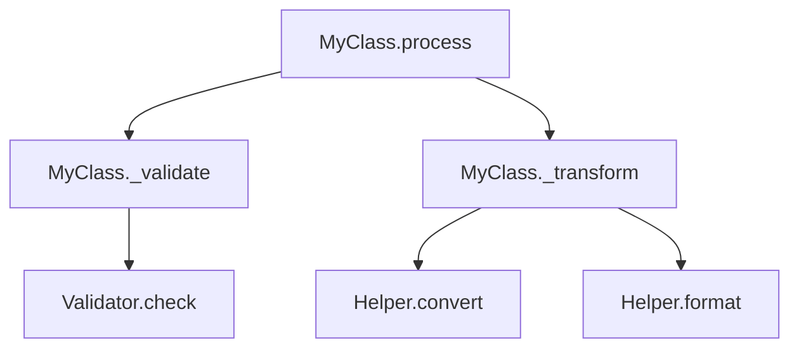

# (Brief #1) Call Flow Analysis - Project Brief

**Version**: v3.63.0 (Initial Design)  
**Purpose**: Static call flow analysis and visualization for Python codebases  
**Foundation**: `osbot_utils.helpers.ast` (existing AST parsing infrastructure)  
**Repo**: https://github.com/owasp-sbot/OSBot-Utils  

---

## Executive Summary

Build a lightweight call flow analysis tool that leverages the existing OSBot-Utils AST infrastructure to:

1. **Parse** Python code starting from a function or class entry point
2. **Connect** all call dependencies into a navigable graph structure
3. **Visualize** the call graph using browser-based renderers (Mermaid, network graphs)
4. **Understand** bottlenecks and optimization opportunities
5. **Refactor** with confidence using before/after comparisons

### Why Not Just Use an LLM?

| LLM-Only Approach | Code-Driven Approach |
|-------------------|----------------------|
| May miss or hallucinate call paths | Deterministic, accurate extraction |
| Hard to version control outputs | Graph data is code → versionable |
| Inconsistent across runs | Reproducible results |
| No animation/interactivity | Rich browser-based visualization |

**Hybrid Strategy**: Use LLMs to *analyze* and *propose* refactorings on the graph data, but generate the actual call flow diagrams from parsed code.

---

## Core Objectives

### Phase 1: Call Graph Extraction
- Take a function or class as entry point
- Extract all method/function calls recursively
- Build a directed graph of call relationships
- Support configurable depth limits

### Phase 2: Visualization
- Generate browser-based interactive visualizations
- Support multiple output formats (Mermaid, network graph, PlantUML)
- Enable "code as data" approach for flexible rendering

### Phase 3: Refactoring Support
- "Digital twin" of codebase for planning refactors
- Before/after comparison views
- Optional: Animate execution paths to identify bottlenecks

---

## Technical Design

### Leveraging Existing AST Infrastructure

The OSBot-Utils AST helpers already provide:

```python
from osbot_utils.helpers.ast import Ast_Module
from osbot_utils.helpers.ast.Ast_Visit import Ast_Visit

# Parse any Python target
module = Ast_Module(MyClass)

# Capture function definitions and calls
with Ast_Visit(module) as visitor:
    visitor.capture_functions()
    visitor.capture_calls()
    visitor.visit()
    
    functions = visitor.captured_nodes()['Ast_Function_Def']
    calls = visitor.captured_nodes()['Ast_Call']
```

### What We Need to Build

#### 1. Call_Graph Class

```python
from osbot_utils.type_safe.Type_Safe import Type_Safe
from typing import Dict, List, Set

class Call_Graph_Node(Type_Safe):
    name        : str                           # Fully qualified name
    node_type   : str                           # 'function', 'method', 'class'
    module      : str                           # Source module
    calls       : List[str]                     # Outgoing calls (names)
    called_by   : List[str]                     # Incoming calls (names)
    depth       : int                           # Distance from entry point
    source_code : str                           # Optional: the actual code

class Call_Graph(Type_Safe):
    entry_point : str                           # Starting function/class
    max_depth   : int              = 5          # How deep to traverse
    nodes       : Dict[str, Call_Graph_Node]    # All discovered nodes
    edges       : List[tuple]                   # (caller, callee) pairs
    
    def build_from(self, target) -> 'Call_Graph':
        """Parse target and build call graph."""
        ...
    
    def to_mermaid(self) -> str:
        """Export as Mermaid flowchart."""
        ...
    
    def to_networkx(self):
        """Export as NetworkX graph for analysis."""
        ...
    
    def to_json(self) -> dict:
        """Export as JSON for browser visualization."""
        ...
```

#### 2. Type Resolution

Since the codebase uses Type_Safe throughout, type resolution is more tractable:

```python
class Type_Resolver(Type_Safe):
    """Resolve call targets to their actual types/modules."""
    
    import_map  : Dict[str, str]                # alias -> full module path
    class_map   : Dict[str, str]                # variable -> class type
    
    def resolve_call(self, call_node: Ast_Call) -> str:
        """
        Given a call like `self.helper.process()`, resolve to:
        'MyClass.helper.process' or 'HelperClass.process'
        """
        ...
```

#### 3. Depth Control Strategy

```python
class Traversal_Config(Type_Safe):
    max_depth           : int  = 5              # Stop after N levels
    include_stdlib      : bool = False          # Skip standard library
    include_external    : bool = False          # Skip pip packages
    module_allowlist    : List[str]             # Only traverse these modules
    module_blocklist    : List[str]             # Never traverse these
    
    # Example: Only analyze our own code
    # module_allowlist = ['osbot_utils', 'myproject']
```

### Proposed Architecture

```
┌─────────────────────────────────────────────────────────────────┐
│                        Call_Flow_Analyzer                        │
├─────────────────────────────────────────────────────────────────┤
│                                                                  │
│  ┌──────────────┐    ┌──────────────┐    ┌──────────────┐       │
│  │  AST Parser  │───▶│ Type Resolver│───▶│ Graph Builder│       │
│  │ (existing)   │    │   (new)      │    │    (new)     │       │
│  └──────────────┘    └──────────────┘    └──────────────┘       │
│         │                                        │               │
│         ▼                                        ▼               │
│  ┌──────────────┐                       ┌──────────────┐        │
│  │  Ast_Visit   │                       │  Call_Graph  │        │
│  │  Ast_Module  │                       │    (new)     │        │
│  └──────────────┘                       └──────────────┘        │
│                                                  │               │
│                    ┌─────────────────────────────┼───────────┐  │
│                    ▼                             ▼           ▼  │
│            ┌──────────────┐           ┌──────────────┐ ┌─────┐ │
│            │   Mermaid    │           │  NetworkX    │ │JSON │ │
│            │   Exporter   │           │  Exporter    │ │ API │ │
│            └──────────────┘           └──────────────┘ └─────┘ │
│                    │                             │           │  │
└────────────────────┼─────────────────────────────┼───────────┼──┘
                     ▼                             ▼           ▼
              ┌──────────────┐           ┌──────────────┐ ┌─────────┐
              │   Mermaid    │           │   D3.js /    │ │ React   │
              │   Live       │           │   vis.js     │ │Component│
              └──────────────┘           └──────────────┘ └─────────┘
                     └─────────────────────────┴───────────────┘
                                    Browser-Based
                                   Visualizations
```

---

## Visualization Options

### Option 1: Mermaid (Recommended Starting Point)



**Pros**: Simple, renders in GitHub/GitLab, easy to diff  
**Cons**: Limited interactivity

### Option 2: Interactive Network Graph (D3.js / vis.js)

- Zoomable, pannable
- Click to expand/collapse branches
- Highlight paths on hover
- Search and filter

### Option 3: Hierarchical Tree View

- Collapsible tree structure
- Shows depth levels clearly
- Good for understanding call chains

### Option 4: Animated Execution Flow

- Step through call sequence
- Highlight active path
- Show timing data (if available from profiling)

---

## Implementation Roadmap

### Milestone 1: Core Graph Extraction (Week 1-2)

**Deliverables:**
- [ ] `Call_Graph` and `Call_Graph_Node` Type_Safe classes
- [ ] Basic call extraction from single function/class
- [ ] Depth-limited traversal
- [ ] Unit tests with sample code

**Key Challenge**: Resolving `self.method()` and attribute chains

### Milestone 2: Type Resolution (Week 2-3)

**Deliverables:**
- [ ] `Type_Resolver` class
- [ ] Import tracking (handle `from x import y as z`)
- [ ] Class attribute type inference
- [ ] Cross-module resolution

**Key Challenge**: Handling dynamic typing, `*args`, `**kwargs`

### Milestone 3: Basic Visualization (Week 3-4)

**Deliverables:**
- [ ] Mermaid exporter
- [ ] JSON export for browser consumption
- [ ] Simple HTML viewer with embedded Mermaid

**Key Challenge**: Readable layout for large graphs

### Milestone 4: Interactive Browser Visualization (Week 4-6)

**Deliverables:**
- [ ] React component for call graph
- [ ] D3.js or vis.js network renderer
- [ ] Filtering and search
- [ ] Expand/collapse functionality

### Milestone 5: Refactoring Support (Week 6-8)

**Deliverables:**
- [ ] Before/after comparison view
- [ ] "Proposed changes" overlay on graph
- [ ] Export diff as actionable refactoring plan
- [ ] Integration with LLM for analysis suggestions

---

## Usage Examples

### Example 1: Analyze a Single Function

```python
from osbot_utils.helpers.ast.call_flow import Call_Flow_Analyzer

analyzer = Call_Flow_Analyzer(max_depth=3)
graph = analyzer.analyze(MyClass.process_data)

# Export to Mermaid
print(graph.to_mermaid())

# Get statistics
print(f"Total functions: {len(graph.nodes)}")
print(f"Max call depth: {graph.max_observed_depth}")
print(f"Leaf functions: {graph.leaf_nodes()}")
```

### Example 2: Analyze with Module Filtering

```python
from osbot_utils.helpers.ast.call_flow import Call_Flow_Analyzer, Traversal_Config

config = Traversal_Config(
    max_depth        = 5,
    include_stdlib   = False,
    module_allowlist = ['myproject', 'osbot_utils']
)

analyzer = Call_Flow_Analyzer(config=config)
graph = analyzer.analyze(MyPipeline)

# Only shows calls within allowed modules
```

### Example 3: Interactive Visualization

```python
from osbot_utils.helpers.ast.call_flow import Call_Flow_Analyzer
from osbot_utils.helpers.ast.call_flow.viz import Call_Graph_Viewer

graph = Call_Flow_Analyzer().analyze(MyClass)

# Launch browser-based viewer
viewer = Call_Graph_Viewer(graph)
viewer.open_in_browser()  # Opens interactive visualization
```

### Example 4: Before/After Refactoring Comparison

```python
from osbot_utils.helpers.ast.call_flow import Call_Flow_Analyzer, Call_Graph_Diff

# Analyze before refactoring
before = Call_Flow_Analyzer().analyze(OldImplementation)

# Analyze after refactoring  
after = Call_Flow_Analyzer().analyze(NewImplementation)

# Compare
diff = Call_Graph_Diff(before, after)
print(diff.summary())
# Added: 3 functions
# Removed: 5 functions
# Modified call paths: 12

diff.to_mermaid_comparison()  # Side-by-side Mermaid
```

---

## Type_Safe Advantage

Because the target codebase uses Type_Safe, we have significant advantages:

1. **Explicit Types**: All attributes are typed → easier to resolve call targets
2. **No Dynamic Attributes**: `__setattr__` enforcement → predictable attribute access
3. **Class Hierarchy**: Clear inheritance chains → can trace method resolution
4. **Consistent Patterns**: Type_Safe classes follow patterns → heuristics work better

```python
# Type_Safe code is easier to analyze
class MyProcessor(Type_Safe):
    helper: Helper_Class              # We KNOW helper is Helper_Class
    
    def process(self, data):
        return self.helper.transform(data)  # Can resolve to Helper_Class.transform
```

---

## Potential Challenges & Mitigations

| Challenge | Mitigation |
|-----------|------------|
| Dynamic dispatch (`getattr`, `**kwargs`) | Mark as "unresolved" in graph, flag for manual review |
| Lambdas and closures | Inline or mark as anonymous nodes |
| Circular dependencies | Detect cycles, mark in visualization |
| Large graphs (100s of nodes) | Clustering, collapsible regions, filtering |
| Cross-module resolution | Build import map first, resolve incrementally |
| External library calls | Option to stub or exclude |

---

## Success Criteria

### Minimum Viable Product (MVP)
- [ ] Parse a function and extract direct calls (depth=1)
- [ ] Generate valid Mermaid diagram
- [ ] Handle basic `self.method()` resolution

### Full Feature Set
- [ ] Configurable depth traversal
- [ ] Cross-module type resolution
- [ ] Interactive browser visualization
- [ ] Before/after comparison
- [ ] Export to multiple formats (Mermaid, JSON, GraphML)

### Stretch Goals
- [ ] Animated execution flow
- [ ] Integration with timestamp_capture for real timing data
- [ ] LLM-assisted refactoring suggestions on graph
- [ ] Git integration for tracking graph changes over time

---

## Next Steps

1. **Create LLM Brief** for AST helpers ✅ (completed above)
2. **Prototype `Call_Graph` extraction** - Start with simple single-file case
3. **Test on real OSBot-Utils code** - Use existing classes as test cases
4. **Iterate on type resolution** - Handle common patterns first
5. **Build Mermaid exporter** - Quick visual feedback loop
6. **Expand to browser visualization** - Once core extraction is solid

---

## Open Questions

1. **Scope of "call"**: Include property access? Dunder methods? Decorators?
2. **Graph storage**: In-memory only, or persist to file/database?
3. **Incremental updates**: Re-parse everything, or detect changes?
4. **Integration point**: Standalone tool, or integrated into existing workflows?

---

## Appendix: Related Existing Code

### From `osbot_utils.helpers.ast.Call_Tree`

There's an existing `Call_Tree` class that was started but not completed:

```python
class Call_Tree:
    def get_called_methods(self, func):
        source = inspect.getsource(func)
        tree = ast.parse(source)
        # ... visitor pattern to collect calls
        return visitor.called_methods
```

This can serve as a starting point, but needs:
- Type resolution
- Depth control  
- Graph structure (not just list)
- Cross-module support

### From `osbot_utils.helpers.ast.Ast_Visit`

The visitor pattern is already implemented and working:

```python
with Ast_Visit(source) as visitor:
    visitor.capture_calls()
    visitor.capture_functions()
    visitor.visit()
    
    # captured_nodes() returns dict of node type -> list of nodes
```

This is the foundation for call extraction.
