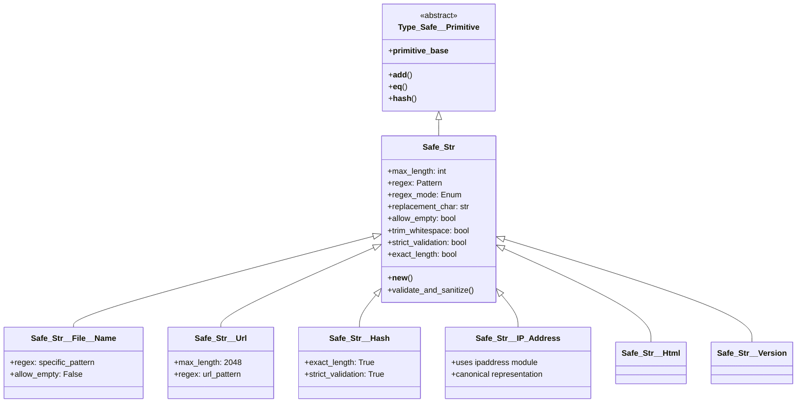

# Safe_Str - Overview and Architecture
_Type-Safe String Primitives with Built-in Validation_

## Overview

Safe_Str is a powerful string validation and sanitization system that extends Python's built-in `str` type with domain-specific constraints and automatic sanitization. It's part of OSBot-Utils' Type_Safe primitive system and provides a foundation for creating secure, validated string types that prevent common security vulnerabilities like injection attacks, path traversal, and XSS.

## Architecture



## Core Features

### 1. Automatic Validation and Sanitization

Safe_Str provides two modes of operation:

**Strict Mode** - Validates and rejects invalid input:
```python
class StrictEmail(Safe_Str):
    regex = re.compile(r'^[\w\.-]+@[\w\.-]+\.\w+$')
    regex_mode = Enum__Safe_Str__Regex_Mode.MATCH
    strict_validation = True

email = StrictEmail("user@example.com")  # ✓ Valid
email = StrictEmail("invalid.email")     # ✗ Raises ValueError
```

**Sanitization Mode** - Automatically cleans invalid characters:
```python
class SafeUsername(Safe_Str):
    regex = re.compile(r'[^a-zA-Z0-9_]')  # Invalid chars
    regex_mode = Enum__Safe_Str__Regex_Mode.REPLACE
    replacement_char = '_'

username = SafeUsername("user@name!")  # Returns: "user_name_"
```

### 2. Regex Modes

Safe_Str supports two regex interpretation modes:

| Mode | Purpose | Behavior |
|------|---------|----------|
| **REPLACE** | Define invalid characters | Replaces matches with replacement_char |
| **MATCH** | Define valid pattern | Validates entire string matches pattern |

```python
# REPLACE mode - regex defines what to remove/replace
class SafeText(Safe_Str):
    regex = re.compile(r'[^a-zA-Z0-9 ]')  # Remove non-alphanumeric
    regex_mode = Enum__Safe_Str__Regex_Mode.REPLACE
    
text = SafeText("Hello@World!")  # Returns: "Hello_World_"

# MATCH mode - regex defines valid pattern
class Version(Safe_Str):
    regex = re.compile(r'^v\d+\.\d+\.\d+$')  # Must match version format
    regex_mode = Enum__Safe_Str__Regex_Mode.MATCH
    strict_validation = True
    
version = Version("v1.2.3")  # ✓ Valid
version = Version("1.2.3")   # ✗ Invalid - missing 'v'
```

### 3. Length Constraints

Multiple options for controlling string length:

```python
class FixedLengthCode(Safe_Str):
    max_length = 10
    exact_length = True  # Must be exactly 10 chars
    
code = FixedLengthCode("ABC1234567")  # ✓ Exactly 10 chars
code = FixedLengthCode("ABC123")      # ✗ ValueError - not 10 chars

class BoundedText(Safe_Str):
    max_length = 100     # Up to 100 chars
    exact_length = False  # Default
    
text = BoundedText("Short text")      # ✓ Under limit
text = BoundedText("x" * 101)         # ✗ ValueError - exceeds max
```

### 4. Whitespace Handling

```python
class TrimmedInput(Safe_Str):
    trim_whitespace = True  # Remove leading/trailing spaces
    
input = TrimmedInput("  hello world  ")  # Returns: "hello world"

class PreserveSpaces(Safe_Str):
    trim_whitespace = False  # Keep all whitespace
    
input = PreserveSpaces("  hello world  ")  # Returns: "  hello world  "
```

### 5. Empty String Handling

```python
class RequiredField(Safe_Str):
    allow_empty = False  # Cannot be empty
    
field = RequiredField("")     # ✗ ValueError
field = RequiredField(None)   # ✗ ValueError
field = RequiredField("data") # ✓ Valid

class OptionalField(Safe_Str):
    allow_empty = True  # Can be empty
    
field = OptionalField("")     # ✓ Returns ""
field = OptionalField(None)   # ✓ Returns ""
```

## Built-in Safe String Types

### File System Types

**Safe_Str__File__Name** - Safe filenames preventing path traversal:
```python
filename = Safe_Str__File__Name("my-file.txt")     # ✓ Valid
filename = Safe_Str__File__Name("../etc/passwd")   # Sanitized to "___etc_passwd"
filename = Safe_Str__File__Name("")                # ✗ ValueError - empty not allowed
```

**Safe_Str__File__Path** - Safe file paths:
```python
path = Safe_Str__File__Path("/home/user/docs/file.txt")  # ✓ Valid
path = Safe_Str__File__Path("C:\\Users\\Docs\\file.txt") # ✓ Valid
path = Safe_Str__File__Path("../../etc/passwd")          # Allowed (but should be validated elsewhere)
```

### Web/Network Types

**Safe_Str__Url** - URL validation and sanitization:
```python
url = Safe_Str__Url("https://example.com/page?q=test")    # ✓ Valid
url = Safe_Str__Url("javascript:alert('xss')")            # Sanitized
url = Safe_Str__Url("https://example.com/<script>")       # Sanitized to remove <script>
```

**Safe_Str__IP_Address** - Valid IP addresses only:
```python
ip = Safe_Str__IP_Address("192.168.1.1")      # ✓ Valid IPv4
ip = Safe_Str__IP_Address("::1")              # ✓ Valid IPv6
ip = Safe_Str__IP_Address("  10.0.0.1  ")     # ✓ Trimmed and valid
ip = Safe_Str__IP_Address("999.999.999.999")  # ✗ ValueError - invalid IP
```

### HTTP Types

**Safe_Str__Http__Content_Type** - HTTP Content-Type headers:
```python
ct = Safe_Str__Http__Content_Type("application/json")           # ✓ Valid
ct = Safe_Str__Http__Content_Type("text/html; charset=utf-8")   # ✓ Valid
ct = Safe_Str__Http__Content_Type("text/html\r\n")             # Sanitized - no CRLF
```

**Safe_Str__Http__ETag** - HTTP ETag headers:
```python
etag = Safe_Str__Http__ETag('"33a64df551"')          # ✓ Valid
etag = Safe_Str__Http__ETag('W/"weak-etag-123"')     # ✓ Valid weak ETag
```

**Safe_Str__Html** - HTML content with minimal filtering:
```python
html = Safe_Str__Html("<div>Hello <b>World</b></div>")  # ✓ Allows HTML
html = Safe_Str__Html("Text with \x00 null byte")       # Null byte removed
```

### Cryptographic Types

**Safe_Str__Hash** - Fixed-length hash values:
```python
hash = Safe_Str__Hash("a1b2c3d4e5")  # ✓ Valid 10-char hex
hash = Safe_Str__Hash("xyz")         # ✗ ValueError - not hex
hash = Safe_Str__Hash("a1b2c3d4e5f") # ✗ ValueError - wrong length

# Helper function for creating hashes
from osbot_utils.helpers.safe_str.Safe_Str__Hash import safe_str_hash
hash_value = safe_str_hash("my data")  # Creates 10-char MD5 hash
```

### Version String

**Safe_Str__Version** - Semantic version validation:
```python
version = Safe_Str__Version("v1.2.3")    # ✓ Valid
version = Safe_Str__Version("v999.0.1")  # ✓ Valid
version = Safe_Str__Version("1.2.3")     # ✗ Missing 'v' prefix
version = Safe_Str__Version("v1.2")      # ✗ Missing patch number
```

## Security Benefits

### 1. Injection Prevention

Safe_Str types automatically prevent various injection attacks:

```python
# SQL Injection Prevention
class SafeSQLIdentifier(Safe_Str):
    regex = re.compile(r'[^a-zA-Z0-9_]')
    
table = SafeSQLIdentifier("users; DROP TABLE users--")
# Returns: "users__DROP_TABLE_users__"

# Command Injection Prevention  
class SafeCommand(Safe_Str):
    regex = re.compile(r'[^a-zA-Z0-9\-]')
    
cmd = SafeCommand("ls -la && rm -rf /")
# Returns: "ls_-la___rm_-rf__"
```

### 2. Path Traversal Prevention

```python
upload_name = Safe_Str__File__Name("../../etc/passwd")
# Returns: "___etc_passwd" - dots and slashes removed

safe_path = Safe_Str__File__Path("/uploads/" + upload_name)
# Safe combination prevents directory escape
```

### 3. XSS Prevention

```python
# For user input that might contain HTML
user_input = Safe_Str__Text("<script>alert('xss')</script>")
# Returns: "_script_alert__xss___script_"

# For HTML content (more permissive but still filtered)
content = Safe_Str__Html("<div onclick='alert(1)'>Click</div>")
# Allows HTML but removes null bytes and control chars
```

### 4. Header Injection Prevention

```python
# HTTP header injection prevention
header_value = Safe_Str__Http__Content_Type("text/html\r\nX-Injected: true")
# CRLF characters removed, preventing header injection
```

## Performance Considerations

Safe_Str validation happens at object creation time:

```python
# Validation cost is one-time at creation
safe_name = Safe_Str__File__Name("my-file.txt")  # Validated here

# Subsequent operations are normal string operations
if safe_name.startswith("my"):    # No extra validation
    result = safe_name.upper()     # No extra validation
```

### Best Practices for Performance

1. **Cache Safe_Str instances** when possible
2. **Use strict_validation** when you want to fail fast
3. **Choose appropriate max_length** to prevent DoS
4. **Consider regex complexity** - simpler patterns are faster

## Creating Custom Safe_Str Types

### Basic Custom Type

```python
import re
from osbot_utils.helpers.safe_str.Safe_Str import Safe_Str

class Safe_Str__Username(Safe_Str):
    regex = re.compile(r'[^a-z0-9_]')  # Only lowercase, numbers, underscore
    max_length = 20
    allow_empty = False
    trim_whitespace = True
    
username = Safe_Str__Username("John_Doe123")  # Returns: "john_doe123"
```

### Advanced Custom Type with Validation

```python
class Safe_Str__Email(Safe_Str):
    regex = re.compile(r'^[a-zA-Z0-9._%+-]+@[a-zA-Z0-9.-]+\.[a-zA-Z]{2,}$')
    regex_mode = Enum__Safe_Str__Regex_Mode.MATCH
    max_length = 254  # RFC 5321
    allow_empty = False
    trim_whitespace = True
    strict_validation = True  # Reject invalid emails
    
    def __new__(cls, value):
        # Additional custom validation
        if value and '@' in value:
            local, domain = value.rsplit('@', 1)
            if len(local) > 64:  # RFC 5321 local part limit
                raise ValueError("Email local part exceeds 64 characters")
        
        return super().__new__(cls, value)
```

### Domain-Specific Type

```python
class Safe_Str__ProductCode(Safe_Str):
    regex = re.compile(r'^[A-Z]{3}-\d{4}-[A-Z]\d$')
    regex_mode = Enum__Safe_Str__Regex_Mode.MATCH
    exact_length = True
    max_length = 11  # XXX-0000-X0
    strict_validation = True
    
# Usage
code = Safe_Str__ProductCode("ABC-1234-X5")  # ✓ Valid
code = Safe_Str__ProductCode("abc-1234-x5")  # ✗ Invalid - must be uppercase
```

## Integration with Type_Safe

Safe_Str types integrate seamlessly with Type_Safe classes:

```python
from osbot_utils.type_safe.Type_Safe import Type_Safe

class UserAccount(Type_Safe):
    username: Safe_Str__Username
    email: Safe_Str__Email
    homepage: Safe_Str__Url
    avatar_path: Safe_Str__File__Path
    ip_address: Safe_Str__IP_Address

# Automatic validation on assignment
user = UserAccount()
user.username = "john_doe"           # Converted to Safe_Str__Username
user.email = "john@example.com"      # Validated as email
user.homepage = "https://example.com" # Validated as URL
user.ip_address = "192.168.1.1"      # Validated as IP

# Serialization preserves string values
data = user.json()
# Returns plain strings in JSON, not objects

# Deserialization recreates Safe_Str types
user2 = UserAccount.from_json(data)
assert isinstance(user2.username, Safe_Str__Username)
```

## Summary

Safe_Str provides a robust foundation for string validation and sanitization with:

- **Automatic sanitization** or strict validation modes
- **Regex-based** character filtering or pattern matching
- **Length constraints** including exact length requirements
- **Whitespace handling** with optional trimming
- **Security-focused** built-in types for common use cases
- **Extensible design** for custom domain types
- **Type_Safe integration** for complete type safety
- **Performance optimized** with validation at creation time

Use Safe_Str types whenever you need to ensure string data conforms to specific patterns or constraints, especially when handling user input or external data.