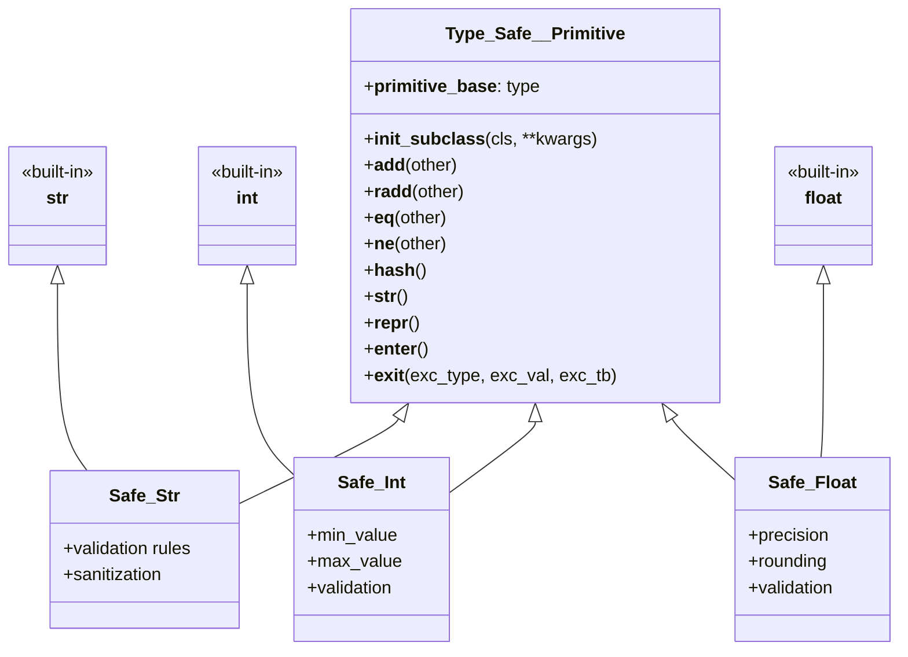

# Type_Safe__Primitive: The Foundation of Safe Python Primitives (str, int, float)

## Overview

`Type_Safe__Primitive` is the foundational base class that enables the creation of type-safe primitive wrappers in OSBot-Utils. It provides the core machinery that allows classes like `Safe_Str`, `Safe_Int`, and `Safe_Float` to behave exactly like Python's built-in primitives (str, int, float) while adding validation, type safety, and domain-specific constraints.

## Core Architecture



The key insight is that Safe types **inherit from both** Type_Safe__Primitive AND a built-in type (str, int, or float), creating a multiple inheritance pattern that combines primitive behavior with type safety.

## Key Components Explained

### 1. Primitive Base Type Caching

```python
__primitive_base__ = None  # Cache the primitive base type at class level

def __init_subclass__(cls, **kwargs):
    super().__init_subclass__(**kwargs)
    for base in cls.__mro__:  # Find and cache the primitive base type
        if base in (str, int, float):  # Currently supports these primitives
            cls.__primitive_base__ = base
            break
```

**What it does:**
- `__init_subclass__` is called automatically when a class inherits from Type_Safe__Primitive
- It walks the Method Resolution Order (MRO) to find which primitive type (str, int, or float) the subclass inherits from
- Caches this information in `__primitive_base__` for efficient access later

**Why it's important:**
- Avoids repeated MRO traversal at runtime
- Enables different behavior based on the primitive type
- Makes operator overloading efficient

**Example:**
```python
class Safe_Str(Type_Safe__Primitive, str):
    pass

# When Safe_Str is defined, __init_subclass__ runs:
# - Examines MRO: [Safe_Str, Type_Safe__Primitive, str, object]
# - Finds 'str' in the MRO
# - Sets Safe_Str.__primitive_base__ = str
```

### 2. Type-Safe Arithmetic Operations

```python
def __add__(self, other):
    """Override addition/concatenation to maintain type safety"""
    if self.__primitive_base__ is str:  # For string concatenation
        result = super().__add__(other)
        return type(self)(result)  # Return instance of the safe type
    else:  # For numeric types (int, float)
        result = super().__add__(other)
        try:
            return type(self)(result)  # Try to create safe type
        except (ValueError, TypeError):
            return result  # Fall back to primitive if constraints violated
```

**What it does:**
- Overrides the `+` operator to maintain type safety
- For strings: Always returns a new instance of the safe type
- For numbers: Attempts to return safe type, but falls back to primitive if constraints are violated

**Why it's clever:**
- Preserves type safety through operations
- Gracefully degrades when results violate constraints
- Maintains the intuitive behavior of primitives

**Examples:**
```python
# String concatenation maintains type
username1 = Safe_Str__Username("john")
username2 = Safe_Str__Username("_doe")
result = username1 + username2  # Returns Safe_Str__Username("john_doe")

# Integer addition with constraints
class Safe_Int__Byte(Safe_Int):
    max_value = 255
    min_value = 0

byte1 = Safe_Int__Byte(200)
byte2 = Safe_Int__Byte(50)
result = byte1 + byte2  # Returns Safe_Int__Byte(250)

byte3 = Safe_Int__Byte(200)
byte4 = Safe_Int__Byte(100)
result = byte3 + byte4  # Returns int(300) - falls back because 300 > 255
```

### 3. Reverse Addition Support

```python
def __radd__(self, other):
    """Reverse addition/concatenation for when safe type is on the right"""
    if self.__primitive_base__ is str:
        result = other + str(self)
        return type(self)(result)
    else:
        result = other + self.__primitive_base__(self)
        try:
            return type(self)(result)
        except (ValueError, TypeError):
            return result
```

**What it does:**
- Handles cases where the safe type is on the right side of addition
- Enables expressions like `"Hello " + safe_string`

**Example:**
```python
safe_name = Safe_Str__Username("alice")
greeting = "Hello " + safe_name  # __radd__ is called
# Returns Safe_Str__Username("Hello alice")
```

### 4. Smart Equality Comparison

```python
def __eq__(self, other):
    if type(self) is type(other):  # Same type → compare values
        return super().__eq__(other)
    if self.__primitive_base__ and type(other) is self.__primitive_base__:
        return super().__eq__(other)  # Compare with primitive
    return False  # Different types → not equal
```

**What it does:**
- Allows comparison between safe types of the same class
- Allows comparison with the underlying primitive type
- Prevents comparison between different safe types

**Why it matters:**
- Prevents type confusion bugs
- Maintains type safety while allowing practical comparisons

**Examples:**
```python
# Same safe type - compares values
user1 = Safe_Str__Username("alice")
user2 = Safe_Str__Username("alice")
assert user1 == user2  # True

# Safe type vs primitive - allowed
user = Safe_Str__Username("alice")
assert user == "alice"  # True - convenience comparison

# Different safe types - not equal even if values match
class UserId(Safe_Str): pass
class ProductId(Safe_Str): pass

user_id = UserId("123")
product_id = ProductId("123")
assert user_id != product_id  # True - different types!
```

### 5. Hash Implementation for Dictionary Keys

```python
def __hash__(self):
    """Include type in hash to maintain hash/eq contract"""
    return hash((type(self).__name__, super().__hash__()))
```

**What it does:**
- Creates a hash that includes both the type name and the value
- Ensures that objects that are not equal (different types) have different hashes

**Why it's important:**
- Allows safe types to be used as dictionary keys
- Maintains Python's hash/equality contract
- Prevents hash collisions between different safe types with same values

**Example:**
```python
# Different types with same value have different hashes
user_id = UserId("123")
product_id = ProductId("123")

data = {
    user_id: "User data",
    product_id: "Product data"
}
# Both keys can exist in the same dict despite having value "123"
```

### 6. String Representation

```python
def __str__(self):
    """Return the primitive string representation"""
    if self.__primitive_base__ is float:
        return format(float(self), '')
    elif self.__primitive_base__ is int:
        return format(int(self), '')
    elif self.__primitive_base__ is str:
        return str.__str__(self)
    return super().__str__()
```

**What it does:**
- Provides clean string representation matching the primitive type
- Uses appropriate formatting for each primitive type

### 7. Debug Representation

```python
def __repr__(self):
    """Enhanced repr for debugging that shows type information"""
    value_str = self.__str__()
    if self.__primitive_base__ is str:
        return f"{type(self).__name__}('{value_str}')"
    else:
        return f"{type(self).__name__}({value_str})"
```

**What it does:**
- Shows both the type and value for debugging
- Makes it clear when you're dealing with a safe type vs primitive

**Example:**
```python
username = Safe_Str__Username("alice")
print(repr(username))  # Safe_Str__Username('alice')

age = Safe_Int__Age(25)
print(repr(age))  # Safe_Int__Age(25)
```

### 8. Context Manager Support

```python
def __enter__(self):
    return self

def __exit__(self, exc_type, exc_val, exc_tb):
    return
```

**What it does:**
- Allows safe types to be used in `with` statements
- Useful for temporary type enforcement or scoped validation

**Example:**
```python
with Safe_Str__TempFile("temp_data.txt") as filename:
    # Use filename with confidence it's safe
    process_file(filename)
# Any cleanup could happen in __exit__ if needed
```

## Design Patterns and Philosophy

### 1. **Transparent Proxy Pattern**
Type_Safe__Primitive acts as a transparent proxy to the underlying primitive, intercepting operations to add type safety while maintaining the primitive's interface.

### 2. **Graceful Degradation**
When operations produce results that violate constraints, the system gracefully falls back to returning primitive types rather than raising exceptions.

### 3. **Type Identity Preservation**
The type of the safe wrapper is part of its identity, preventing accidental mixing of different domain types even when values are identical.

### 4. **Zero-Cost Abstraction (Almost)**
After creation, safe types behave like primitives with minimal overhead. The validation cost is paid once at creation time.

## Advanced Usage Patterns

### Creating a Custom Safe Type

```python
class Safe_Int__Port(Type_Safe__Primitive, int):
    min_value = 0
    max_value = 65535
    
    def __new__(cls, value):
        if not cls.min_value <= value <= cls.max_value:
            raise ValueError(f"Port must be between {cls.min_value} and {cls.max_value}")
        return super().__new__(cls, value)

# Usage
port = Safe_Int__Port(8080)
print(port + 1)  # 8081 (returns Safe_Int__Port if valid)

high_port = Safe_Int__Port(65000)
result = high_port + 1000  # Returns int(66000) - outside valid range
```

### Type-Safe Collections

```python
# Create a dictionary with type-safe keys
user_scores = {}
user_scores[UserId("user_123")] = 100
user_scores[UserId("user_456")] = 200

# These are different keys even though the string value is the same
user_scores[UserId("123")] = 10
user_scores[ProductId("123")] = 20
print(len(user_scores))  # 4 entries
```

### Domain Modeling

```python
class EmailAddress(Type_Safe__Primitive, str):
    def __new__(cls, value):
        if '@' not in value:
            raise ValueError("Invalid email address")
        return super().__new__(cls, value.lower())

class Username(Type_Safe__Primitive, str):
    def __new__(cls, value):
        if not value.replace('_', '').isalnum():
            raise ValueError("Username must be alphanumeric")
        return super().__new__(cls, value.lower())

# Now emails and usernames can't be accidentally mixed
def send_email(to: EmailAddress, subject: str):
    # Can't accidentally pass a Username here
    pass
```

## Performance Considerations

1. **Creation Overhead**: Validation happens at object creation
2. **Operation Overhead**: Minimal - one extra function call for operators
3. **Memory Overhead**: One additional class attribute (`__primitive_base__`)
4. **Cache Efficiency**: Type information cached at class level, not instance

## Security Benefits

1. **Type Confusion Prevention**: Different safe types are truly different types
2. **Invariant Maintenance**: Constraints are enforced through operations
3. **Fail-Safe Defaults**: Invalid operations return primitives, not corrupted safe types
4. **Clear Boundaries**: Type information preserved in repr/debugging

## Common Pitfalls and Solutions

### Pitfall 1: Forgetting Type Changes in Operations
```python
# Problem
byte = Safe_Int__Byte(200)
result = byte + 100  # Returns int(300), not Safe_Int__Byte

# Solution: Check type when it matters
if isinstance(result, Safe_Int__Byte):
    # Safe to use as byte
    pass
else:
    # Handle overflow case
    pass
```

### Pitfall 2: Assuming All Operations Return Safe Types
```python
# String operations might not return safe types
safe_str = Safe_Str__Username("alice")
upper = safe_str.upper()  # Returns regular str, not Safe_Str__Username

# Solution: Re-wrap if needed
upper_safe = Safe_Str__Username(upper)
```

## Summary

Type_Safe__Primitive provides a sophisticated foundation for creating type-safe primitive wrappers that:

1. **Maintain primitive behavior** while adding validation
2. **Preserve type identity** to prevent domain confusion
3. **Support all primitive operations** with type safety
4. **Gracefully handle** constraint violations
5. **Integrate seamlessly** with Python's type system

This design enables the creation of domain-specific types that are both safe and ergonomic, making it easy to write secure code without sacrificing Python's flexibility and expressiveness.