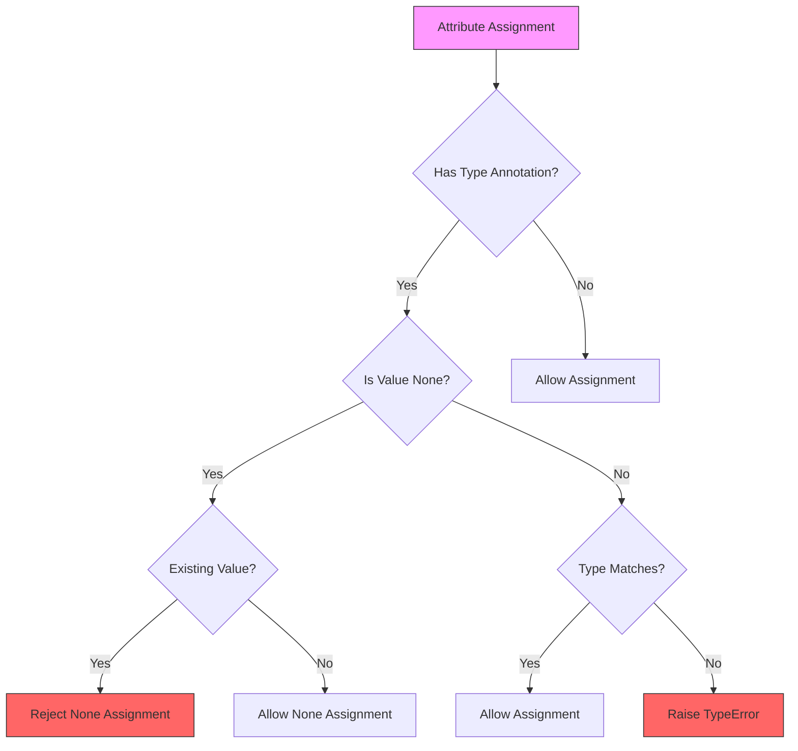
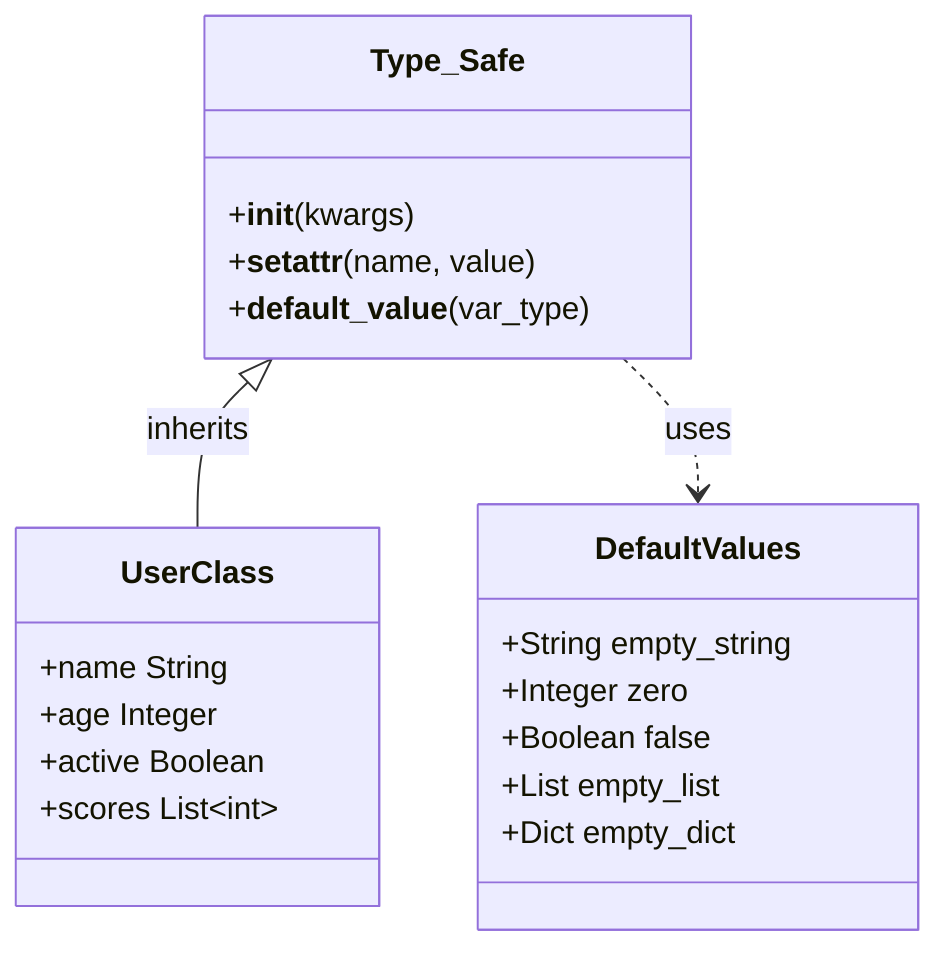
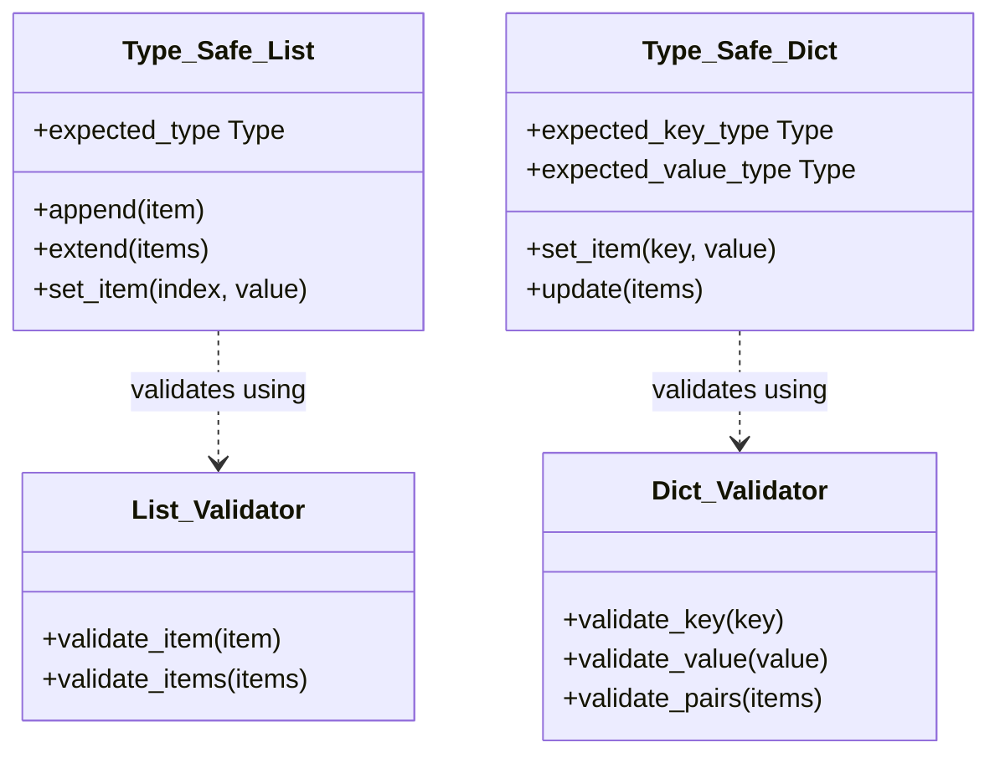
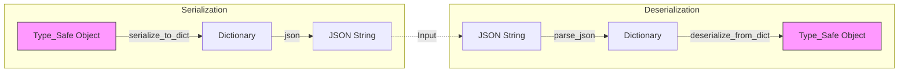
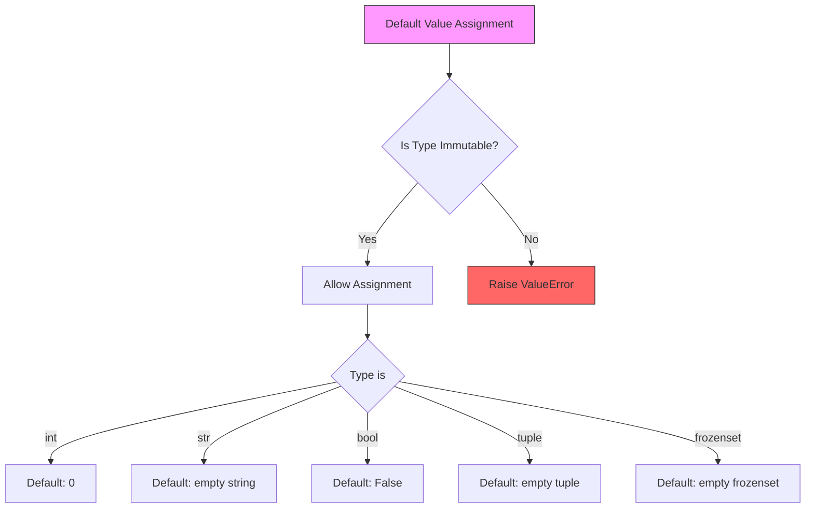
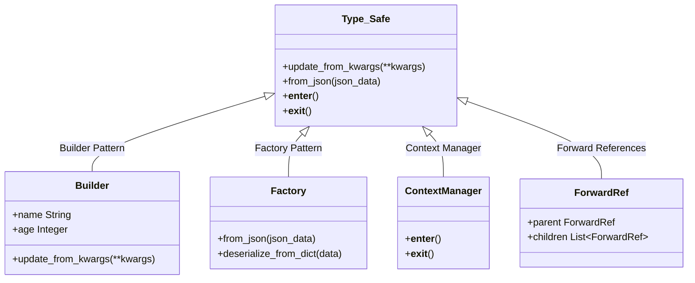
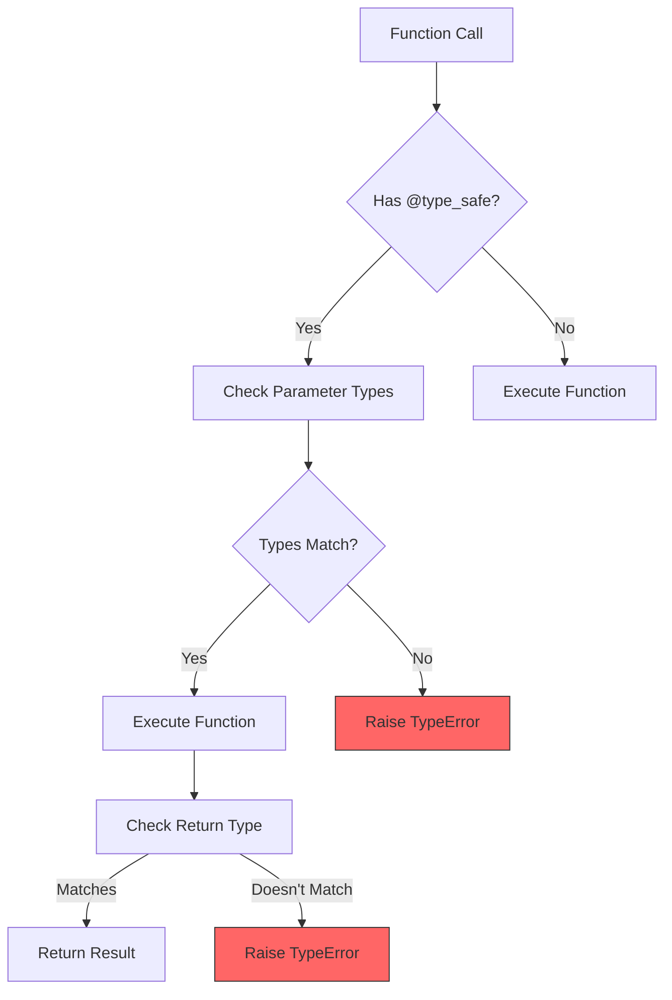

# Visual Guide to Type_Safe Features and Patterns

## Core Features

### 1. Runtime Type Checking
How Type_Safe validates type safety during attribute assignment:



Key points:
- Validates type annotations during runtime
- Handles None values appropriately
- Provides clear error messages for type violations
- Prevents invalid assignments

### 2. Automatic Attribute Management
How Type_Safe manages class attributes and their initialization:



Key points:
- Automatic attribute creation from type annotations
- Default value initialization
- Inheritance handling
- Type-safe attribute management

### 3. Type-Safe Collections Support
How Type_Safe handles collections with type safety:



Key points:
- Type-safe list operations
- Type-safe dictionary operations
- Validation for both keys and values
- Support for nested collections

### 4. Serialization & Deserialization
The flow of data during serialization and deserialization:



Key points:
- Bidirectional conversion
- Type safety preservation
- JSON compatibility
- Nested object handling

### 5. Immutability Controls
How Type_Safe manages immutable default values:



Key points:
- Enforces immutable defaults
- Prevents mutable default issues
- Clear type definitions
- Safe initialization

## Design Patterns

### 1-4. Primary Design Patterns
How Type_Safe implements various design patterns:



### 5. Type-Safe Decorator Pattern
How the @type_safe decorator validates types:



## Usage Examples

### Basic Class Definition
```python
class UserProfile(Type_Safe):
    name: str
    age: int
    active: bool = True
    scores: List[int] = []
```

### Using the Builder Pattern
```python
profile = UserProfile().update_from_kwargs(
    name="John",
    age=30
)
```

### Using the Factory Pattern
```python
profile = UserProfile.from_json('{"name": "John", "age": 30}')
```

### Using the Context Manager
```python
with UserProfile() as profile:
    profile.name = "John"
    profile.age = 30
```

### Using Forward References
```python
class Node(Type_Safe):
    value: int
    parent: Optional['Node'] = None
    children: List['Node'] = []
```

### Using the Type-Safe Decorator
```python
@type_safe
def process_user(user: UserProfile) -> Dict[str, Any]:
    return {"status": "success", "data": user.json()}
```
