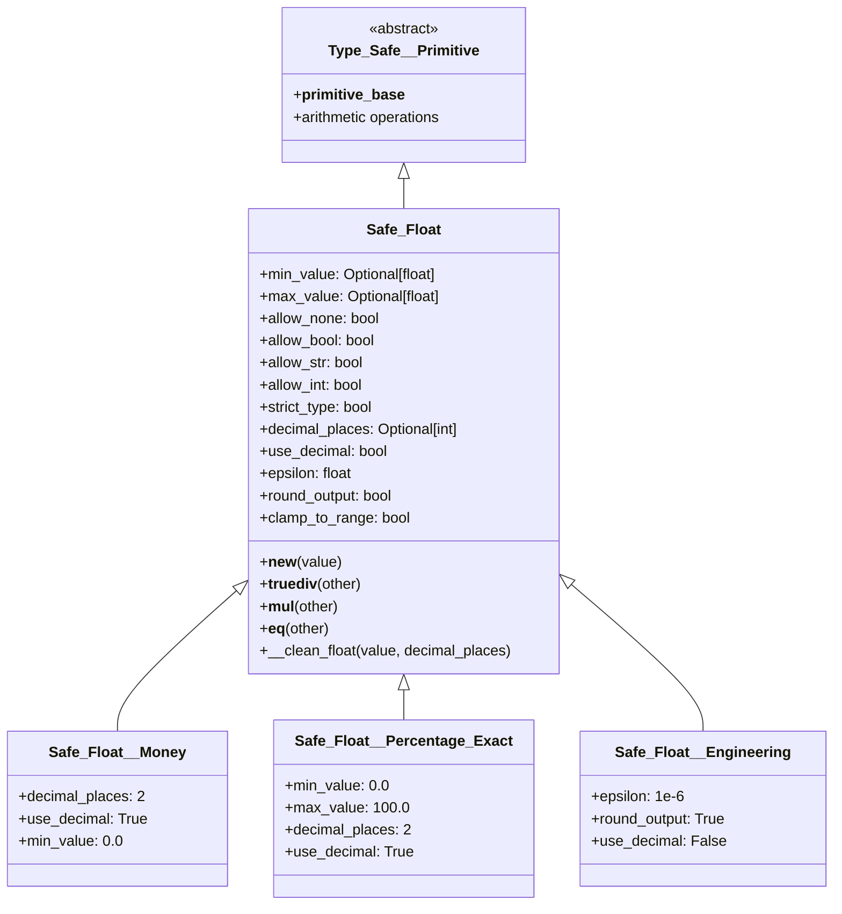

# Safe_Float - Type-Safe Floating-Point Primitives with Precision Control

## Overview

Safe_Float provides a comprehensive system for creating type-safe floating-point types with advanced precision control, range validation, and domain-specific behavior. It addresses the fundamental challenges of floating-point arithmetic in Python by offering configurable precision handling, optional decimal arithmetic for exactness, and intelligent rounding strategies.

## Core Architecture



## The Floating-Point Problem Safe_Float Solves

### Traditional Python Float Issues

```python
# Classic floating-point problems
print(0.1 + 0.2)           # 0.30000000000000004 (not 0.3!)
print(0.1 + 0.2 == 0.3)    # False!

# Currency calculations gone wrong
price = 19.99
tax = 0.0825
total = price * (1 + tax)  # 21.639174999999998 (not 21.64!)

# Percentage precision issues
completion = 100 * (7/9)   # 77.77777777777779
```

### Safe_Float Solutions

```python
from osbot_utils.type_safe.primitives.safe_float.Safe_Float__Money import Safe_Float__Money
from osbot_utils.type_safe.primitives.safe_float.Safe_Float__Percentage_Exact import Safe_Float__Percentage_Exact

# Exact money calculations
price = Safe_Float__Money(19.99)
tax_rate = Safe_Float__Money(0.0825)
total = price * (1 + tax_rate)  # Exactly 21.64

# Precise percentage calculations
completion = Safe_Float__Percentage_Exact(100 * (7/9))  # Exactly 77.78
```

## Configuration Options

Safe_Float provides extensive configuration for different use cases:

### Type Conversion Options

| Attribute | Type | Default | Description |
|-----------|------|---------|-------------|
| `allow_none` | `bool` | `True` | Whether None converts to 0.0 |
| `allow_bool` | `bool` | `False` | Whether bool values are accepted |
| `allow_str` | `bool` | `True` | Whether string conversion is allowed |
| `allow_int` | `bool` | `True` | Whether integer conversion is allowed |
| `strict_type` | `bool` | `False` | If True, only accept float type |

### Range Validation Options

| Attribute | Type | Default | Description |
|-----------|------|---------|-------------|
| `min_value` | `Optional[float]` | `None` | Minimum allowed value |
| `max_value` | `Optional[float]` | `None` | Maximum allowed value |
| `clamp_to_range` | `bool` | `False` | Clamp values to range instead of error |

### Precision Control Options

| Attribute | Type | Default | Description |
|-----------|------|---------|-------------|
| `decimal_places` | `Optional[int]` | `None` | Number of decimal places to maintain |
| `use_decimal` | `bool` | `False` | Use Python's Decimal for exact arithmetic |
| `epsilon` | `float` | `1e-9` | Tolerance for equality comparisons |
| `round_output` | `bool` | `True` | Round results to decimal_places |

## Key Features Explained

### 1. Decimal vs Float Mode

Safe_Float can operate in two modes:

**Float Mode (default)** - Fast but potentially inexact:
```python
class FastCalculation(Safe_Float):
    use_decimal = False  # Default
    decimal_places = 2

calc = FastCalculation(0.1)
result = calc + FastCalculation(0.2)  # May have tiny errors
```

**Decimal Mode** - Exact but slower:
```python
class ExactCalculation(Safe_Float):
    use_decimal = True
    decimal_places = 2

calc = ExactCalculation(0.1)
result = calc + ExactCalculation(0.2)  # Exactly 0.30
```

### 2. Intelligent Float Cleaning

The `__clean_float` method detects and corrects floating-point representation errors:

```python
@classmethod
def __clean_float(cls, value: float, decimal_places: int) -> float:
    # Detects patterns like 0.299999999999 or 0.300000000001
    # and corrects them to 0.30
```

This handles cases where floating-point math produces values very close to, but not exactly, the expected decimal value.

### 3. Range Validation with Options

**Strict Mode** (default) - Raises errors:
```python
class StrictPercentage(Safe_Float):
    min_value = 0.0
    max_value = 100.0
    clamp_to_range = False  # Default

pct = StrictPercentage(150)  # ✗ ValueError: must be <= 100.0
```

**Clamping Mode** - Automatically adjusts:
```python
class ClampedPercentage(Safe_Float):
    min_value = 0.0
    max_value = 100.0
    clamp_to_range = True

pct = ClampedPercentage(150)  # Returns 100.0 (clamped)
pct = ClampedPercentage(-10)  # Returns 0.0 (clamped)
```

### 4. Epsilon-Based Equality

Floating-point equality uses epsilon tolerance:

```python
class Measurement(Safe_Float):
    epsilon = 0.001  # Tolerance for comparisons

m1 = Measurement(1.0)
m2 = Measurement(1.0001)
print(m1 == m2)  # True (within epsilon)

m3 = Measurement(1.01)
print(m1 == m3)  # False (exceeds epsilon)
```

### 5. Special Value Handling

Safe_Float explicitly rejects infinity and NaN:

```python
import math

value = Safe_Float(math.inf)   # ✗ ValueError: does not allow infinite values
value = Safe_Float(math.nan)   # ✗ ValueError: does not allow NaN values
value = Safe_Float(1.0 / 0.0)  # ✗ ValueError: does not allow infinite values
```

## Built-in Safe Float Types

### Safe_Float__Money - Financial Calculations

```python
from osbot_utils.type_safe.primitives.safe_float.Safe_Float__Money import Safe_Float__Money

# Configuration:
# - decimal_places = 2 (cents precision)
# - use_decimal = True (exact arithmetic)
# - min_value = 0.0 (no negative amounts)
# - round_output = True

# Currency calculations
price = Safe_Float__Money(19.99)
tax = Safe_Float__Money(1.65)
total = price + tax  # Exactly 21.64

# Percentage calculations
discount_rate = Safe_Float__Money(0.15)  # 15%
discount = price * discount_rate  # Exactly 3.00
final_price = price - discount    # Exactly 16.99

# Division with rounding
split = Safe_Float__Money(100.00)
three_way = split / 3  # 33.33 (not 33.333333...)

# Prevents negative money
refund = Safe_Float__Money(-10.00)  # ✗ ValueError: must be >= 0.0
```

### Safe_Float__Percentage_Exact - Precise Percentages

```python
from osbot_utils.type_safe.primitives.safe_float.Safe_Float__Percentage_Exact import Safe_Float__Percentage_Exact

# Configuration:
# - min_value = 0.0, max_value = 100.0
# - decimal_places = 2
# - use_decimal = True

# Progress calculations
completed = Safe_Float__Percentage_Exact(75.5)
remaining = Safe_Float__Percentage_Exact(100.0) - completed  # Exactly 24.50

# Fraction to percentage
ratio = Safe_Float__Percentage_Exact(100 * (7/9))  # 77.78 (not 77.777...)

# Bounds enforcement
over = Safe_Float__Percentage_Exact(101.0)   # ✗ ValueError: must be <= 100.0
under = Safe_Float__Percentage_Exact(-1.0)   # ✗ ValueError: must be >= 0.0
```

### Safe_Float__Engineering - Engineering Calculations

```python
from osbot_utils.type_safe.primitives.safe_float.Safe_Float__Engineering import Safe_Float__Engineering

# Configuration:
# - epsilon = 1e-6 (engineering tolerance)
# - round_output = True
# - use_decimal = False (performance over exactness)

# Scientific calculations
voltage = Safe_Float__Engineering(3.3)
current = Safe_Float__Engineering(0.025)
power = voltage * current  # Clean result without excessive decimals

# Tolerance-based comparisons
measured = Safe_Float__Engineering(3.300001)
expected = Safe_Float__Engineering(3.3)
print(measured == expected)  # True (within epsilon)
```

## Real-World Usage Examples

### E-Commerce Pricing System

```python
from osbot_utils.type_safe.Type_Safe import Type_Safe

class ProductPricing(Type_Safe):
    base_price: Safe_Float__Money
    tax_rate: Safe_Float__Percentage_Exact
    discount_percentage: Safe_Float__Percentage_Exact
    shipping_cost: Safe_Float__Money
    
    def calculate_subtotal(self) -> Safe_Float__Money:
        """Calculate price after discount"""
        discount_amount = self.base_price * (self.discount_percentage / 100)
        return self.base_price - discount_amount
    
    def calculate_tax(self) -> Safe_Float__Money:
        """Calculate tax on subtotal"""
        subtotal = self.calculate_subtotal()
        return subtotal * (self.tax_rate / 100)
    
    def calculate_total(self) -> Safe_Float__Money:
        """Calculate final price including tax and shipping"""
        subtotal = self.calculate_subtotal()
        tax = self.calculate_tax()
        return subtotal + tax + self.shipping_cost

# Usage
pricing = ProductPricing(
    base_price=99.99,
    tax_rate=8.25,
    discount_percentage=10.0,
    shipping_cost=5.99
)

print(f"Subtotal: ${pricing.calculate_subtotal()}")  # $89.99
print(f"Tax: ${pricing.calculate_tax()}")            # $7.42
print(f"Total: ${pricing.calculate_total()}")        # $103.40

# All calculations are exact to the penny!
```

### Scientific Measurement System

```python
class Measurement(Type_Safe):
    temperature_c: Safe_Float__Engineering
    pressure_bar: Safe_Float__Engineering
    flow_rate_lpm: Safe_Float__Engineering
    
    def temperature_f(self) -> Safe_Float__Engineering:
        """Convert Celsius to Fahrenheit"""
        return Safe_Float__Engineering(self.temperature_c * 9/5 + 32)
    
    def pressure_psi(self) -> Safe_Float__Engineering:
        """Convert bar to PSI"""
        return Safe_Float__Engineering(self.pressure_bar * 14.5038)
    
    def validate_operating_range(self):
        """Check if measurements are within safe operating range"""
        if not (0 <= self.temperature_c <= 100):
            raise ValueError(f"Temperature {self.temperature_c}°C out of range")
        
        if not (1 <= self.pressure_bar <= 10):
            raise ValueError(f"Pressure {self.pressure_bar} bar out of range")
        
        if not (0 <= self.flow_rate_lpm <= 100):
            raise ValueError(f"Flow rate {self.flow_rate_lpm} L/min out of range")

measurement = Measurement(
    temperature_c=25.5,
    pressure_bar=3.2,
    flow_rate_lpm=45.7
)

print(f"Temperature: {measurement.temperature_f()}°F")
print(f"Pressure: {measurement.pressure_psi()} PSI")
measurement.validate_operating_range()  # Passes
```

### Financial Portfolio Management

```python
class PortfolioPosition(Type_Safe):
    symbol: str
    shares: int
    purchase_price: Safe_Float__Money
    current_price: Safe_Float__Money
    allocation_percentage: Safe_Float__Percentage_Exact
    
    def cost_basis(self) -> Safe_Float__Money:
        """Total investment cost"""
        return Safe_Float__Money(self.shares * self.purchase_price)
    
    def current_value(self) -> Safe_Float__Money:
        """Current market value"""
        return Safe_Float__Money(self.shares * self.current_price)
    
    def gain_loss(self) -> Safe_Float__Money:
        """Profit or loss"""
        return self.current_value() - self.cost_basis()
    
    def gain_loss_percentage(self) -> Safe_Float__Percentage_Exact:
        """Percentage gain or loss"""
        if self.cost_basis() == 0:
            return Safe_Float__Percentage_Exact(0)
        
        pct = 100 * (self.gain_loss() / self.cost_basis())
        # Allow negative percentages for losses
        if pct < 0:
            return Safe_Float__Percentage_Exact(0)  # Or handle differently
        return Safe_Float__Percentage_Exact(min(pct, 100))

position = PortfolioPosition(
    symbol="AAPL",
    shares=100,
    purchase_price=150.00,
    current_price=175.50,
    allocation_percentage=25.5
)

print(f"Cost Basis: ${position.cost_basis()}")         # $15,000.00
print(f"Current Value: ${position.current_value()}")   # $17,550.00
print(f"Gain/Loss: ${position.gain_loss()}")          # $2,550.00
```

### Grade Calculation System

```python
class GradeCalculator(Type_Safe):
    assignments: List[Safe_Float__Percentage_Exact]
    exams: List[Safe_Float__Percentage_Exact]
    participation: Safe_Float__Percentage_Exact
    
    # Weights must sum to 100
    assignment_weight: Safe_Float__Percentage_Exact = Safe_Float__Percentage_Exact(30.0)
    exam_weight: Safe_Float__Percentage_Exact = Safe_Float__Percentage_Exact(60.0)
    participation_weight: Safe_Float__Percentage_Exact = Safe_Float__Percentage_Exact(10.0)
    
    def assignment_average(self) -> Safe_Float__Percentage_Exact:
        """Calculate assignment average"""
        if not self.assignments:
            return Safe_Float__Percentage_Exact(0)
        
        total = sum(float(a) for a in self.assignments)
        avg = total / len(self.assignments)
        return Safe_Float__Percentage_Exact(avg)
    
    def exam_average(self) -> Safe_Float__Percentage_Exact:
        """Calculate exam average"""
        if not self.exams:
            return Safe_Float__Percentage_Exact(0)
        
        total = sum(float(e) for e in self.exams)
        avg = total / len(self.exams)
        return Safe_Float__Percentage_Exact(avg)
    
    def final_grade(self) -> Safe_Float__Percentage_Exact:
        """Calculate weighted final grade"""
        assignment_contrib = self.assignment_average() * (self.assignment_weight / 100)
        exam_contrib = self.exam_average() * (self.exam_weight / 100)
        participation_contrib = self.participation * (self.participation_weight / 100)
        
        total = assignment_contrib + exam_contrib + participation_contrib
        return Safe_Float__Percentage_Exact(total)
    
    def letter_grade(self) -> str:
        """Convert percentage to letter grade"""
        grade = self.final_grade()
        if grade >= 90: return 'A'
        if grade >= 80: return 'B'
        if grade >= 70: return 'C'
        if grade >= 60: return 'D'
        return 'F'

calculator = GradeCalculator(
    assignments=[85.5, 92.0, 78.5, 88.0],
    exams=[82.0, 90.0],
    participation=95.0
)

print(f"Assignment Average: {calculator.assignment_average()}%")  # 86.00%
print(f"Exam Average: {calculator.exam_average()}%")              # 86.00%
print(f"Final Grade: {calculator.final_grade()}%")                # 86.30%
print(f"Letter Grade: {calculator.letter_grade()}")               # B
```

## Creating Custom Safe Float Types

### Domain-Specific Types

```python
# GPS Coordinates (-180 to 180 for longitude, -90 to 90 for latitude)
class Longitude(Safe_Float):
    min_value = -180.0
    max_value = 180.0
    decimal_places = 6  # ~0.1 meter precision
    use_decimal = True

class Latitude(Safe_Float):
    min_value = -90.0
    max_value = 90.0
    decimal_places = 6
    use_decimal = True

# Temperature with conversion methods
class Temperature(Safe_Float):
    min_value = -273.15  # Absolute zero in Celsius
    max_value = 5778     # Surface of the sun
    decimal_places = 2
    
    def to_fahrenheit(self) -> float:
        return float(self) * 9/5 + 32
    
    def to_kelvin(self) -> float:
        return float(self) + 273.15

# Currency with multiple denominations
class Currency(Safe_Float__Money):
    def to_cents(self) -> int:
        return int(self * 100)
    
    def to_dollars_and_cents(self) -> tuple[int, int]:
        total_cents = self.to_cents()
        return divmod(total_cents, 100)
    
    def __str__(self):
        return f"${float(self):.2f}"

# Physics calculations
class Velocity(Safe_Float):
    min_value = 0.0
    max_value = 299792458  # Speed of light in m/s
    decimal_places = 3
    epsilon = 0.001
    
    def to_kmh(self) -> float:
        return float(self) * 3.6
    
    def to_mph(self) -> float:
        return float(self) * 2.23694
```

### Validation with Business Rules

```python
class InterestRate(Safe_Float__Percentage_Exact):
    min_value = 0.0
    max_value = 30.0  # Cap at 30% to prevent usury
    
    def monthly_rate(self) -> 'InterestRate':
        """Convert annual rate to monthly"""
        monthly = float(self) / 12
        return InterestRate(monthly)
    
    def compound(self, periods: int) -> float:
        """Calculate compound interest multiplier"""
        rate = float(self) / 100
        return (1 + rate) ** periods

class ExchangeRate(Safe_Float):
    min_value = 0.0001  # Prevent divide by zero
    max_value = 10000   # Sanity check
    decimal_places = 4
    use_decimal = True
    
    def convert(self, amount: Safe_Float__Money) -> Safe_Float__Money:
        """Convert currency using this rate"""
        return Safe_Float__Money(float(amount) * float(self))
    
    def inverse(self) -> 'ExchangeRate':
        """Get inverse exchange rate"""
        return ExchangeRate(1.0 / float(self))
```

## Performance Considerations

### Mode Selection

| Mode | Speed | Precision | Use Case |
|------|-------|-----------|----------|
| Float (default) | Fast | Good enough | General calculations |
| Decimal | Slower | Exact | Financial, percentages |

### Benchmarks

```python
import timeit

# Float mode - fast
float_time = timeit.timeit(
    'Safe_Float__Engineering(1.1) + Safe_Float__Engineering(2.2)',
    globals=globals(),
    number=100000
)

# Decimal mode - slower but exact
decimal_time = timeit.timeit(
    'Safe_Float__Money(1.1) + Safe_Float__Money(2.2)',
    globals=globals(),
    number=100000
)

print(f"Float mode: {float_time:.3f}s")    # ~0.5s
print(f"Decimal mode: {decimal_time:.3f}s") # ~2.0s
```

### Optimization Tips

1. **Use float mode** for engineering/scientific calculations where small errors are acceptable
2. **Use decimal mode** for money and exact percentages
3. **Cache instances** when using the same values repeatedly
4. **Batch operations** on raw floats, then validate results
5. **Adjust epsilon** based on your precision needs

## Error Handling

Safe_Float provides comprehensive error messages:

```python
# Type errors
try:
    Safe_Float__Money(True)
except TypeError as e:
    print(e)  # "Safe_Float__Money does not allow boolean values"

# Value errors
try:
    Safe_Float__Percentage_Exact(150)
except ValueError as e:
    print(e)  # "Safe_Float__Percentage_Exact must be <= 100.0, got 150"

# Conversion errors
try:
    Safe_Float__Money("not a number")
except ValueError as e:
    print(e)  # "Cannot convert 'not a number' to float"

# Special value errors
try:
    import math
    Safe_Float(math.inf)
except ValueError as e:
    print(e)  # "Safe_Float does not allow infinite values"

# Division by zero
try:
    Safe_Float__Money(100) / 0
except ZeroDivisionError as e:
    print(e)  # "Safe_Float__Money division by zero"
```

## Best Practices

### 1. Choose the Right Mode

```python
# Money - always use decimal
class Price(Safe_Float):
    use_decimal = True
    decimal_places = 2

# Engineering - float is usually fine
class Measurement(Safe_Float):
    use_decimal = False
    epsilon = 0.001
```

### 2. Set Appropriate Precision

```python
# GPS coordinates need high precision
class GPSCoordinate(Safe_Float):
    decimal_places = 8  # ~1mm precision

# Display percentages need less
class DisplayPercentage(Safe_Float):
    decimal_places = 1  # 75.5%
```

### 3. Handle Edge Cases

```python
class SafeDivision(Safe_Float):
    @classmethod
    def divide_safe(cls, a: float, b: float) -> Optional['SafeDivision']:
        """Safe division with None on error"""
        if b == 0:
            return None
        try:
            return cls(a / b)
        except (ValueError, OverflowError):
            return None
```

### 4. Document Precision Requirements

```python
class CriticalMeasurement(Safe_Float):
    """
    Critical measurement requiring exactly 3 decimal places.
    Uses Decimal arithmetic to ensure precision.
    Range: 0.001 to 999.999
    """
    min_value = 0.001
    max_value = 999.999
    decimal_places = 3
    use_decimal = True
    round_output = True
```

## Summary

Safe_Float provides a robust solution for floating-point arithmetic with:

- **Precision Control**: Configurable decimal places with exact or approximate arithmetic
- **Range Validation**: Min/max bounds with optional clamping
- **Special Value Handling**: Rejects infinity and NaN
- **Domain-Specific Types**: Money, percentages, engineering values
- **Intelligent Rounding**: Detects and corrects representation errors
- **Flexible Conversion**: Handles strings, integers, None with configuration
- **Performance Options**: Choose between speed (float) and exactness (Decimal)

The combination of precision control and type safety makes Safe_Float ideal for:
- Financial calculations requiring penny-perfect accuracy
- Scientific measurements with known precision requirements
- Percentage calculations that must stay within bounds
- Engineering calculations with tolerance-based comparisons
- Any domain where floating-point errors are unacceptable