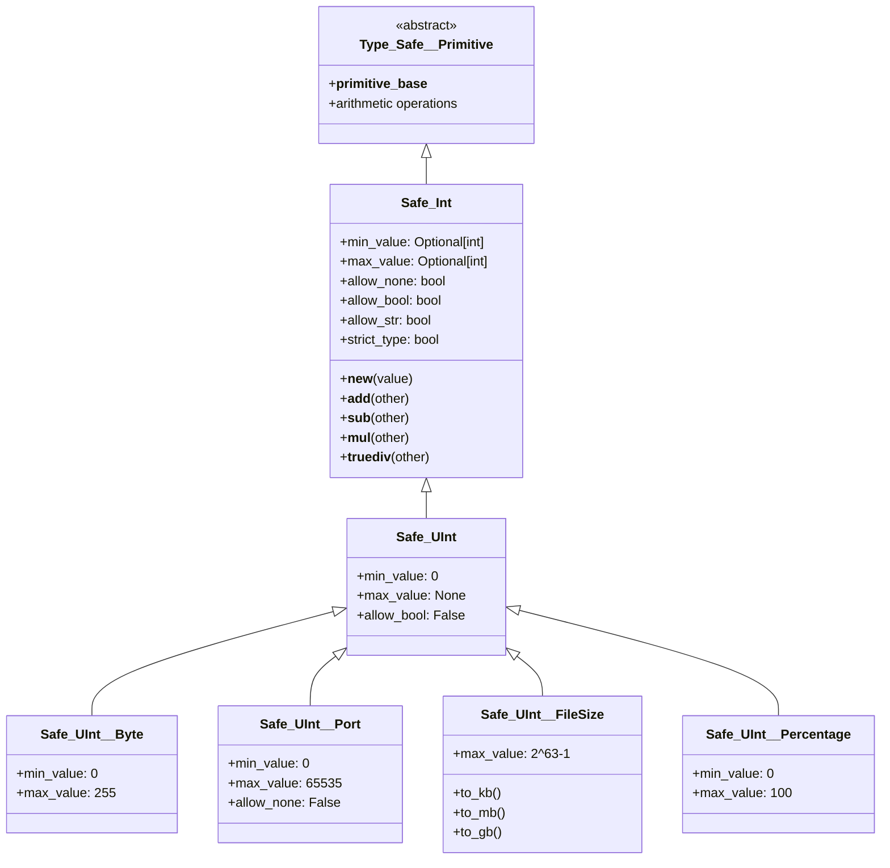

# Safe_Int - Type-Safe Integer Primitives with Domain Validation

## Overview

Safe_Int provides a comprehensive system for creating type-safe integer types with domain-specific validation rules. Built on top of `Type_Safe__Primitive`, it extends Python's built-in `int` type with configurable constraints, automatic type conversion, and range validation while maintaining full compatibility with integer operations.

## Architecture



## Core Features

### Configuration Options

Safe_Int provides six configuration attributes that control validation and conversion behavior:

| Attribute | Type | Default | Description |
|-----------|------|---------|-------------|
| `min_value` | `Optional[int]` | `None` | Minimum allowed value (inclusive) |
| `max_value` | `Optional[int]` | `None` | Maximum allowed value (inclusive) |
| `allow_none` | `bool` | `True` | Whether None converts to 0 |
| `allow_bool` | `bool` | `False` | Whether bool values are accepted |
| `allow_str` | `bool` | `True` | Whether string conversion is allowed |
| `strict_type` | `bool` | `False` | If True, only accept int type (no conversions) |

### Type Conversion Behavior

Safe_Int intelligently handles various input types:

```python
from osbot_utils.type_safe.primitives.safe_int.Safe_Int import Safe_Int

# String conversion (when allow_str=True)
value = Safe_Int("42")        # ✓ Returns Safe_Int(42)
value = Safe_Int("  42  ")    # ✓ Strips whitespace, returns Safe_Int(42)
value = Safe_Int("invalid")   # ✗ ValueError: Cannot convert 'invalid' to integer

# None handling (when allow_none=True)
value = Safe_Int(None)        # ✓ Returns Safe_Int(0)

# Boolean handling (when allow_bool=False by default)
value = Safe_Int(True)        # ✗ TypeError: does not allow boolean values
value = Safe_Int(False)       # ✗ TypeError: does not allow boolean values

# Strict type mode
class StrictInt(Safe_Int):
    strict_type = True

strict = StrictInt(42)        # ✓ Works
strict = StrictInt("42")      # ✗ TypeError: requires int type
```

### Range Validation

Safe_Int enforces min/max constraints at creation time:

```python
class Age(Safe_Int):
    min_value = 0
    max_value = 150

age = Age(25)                 # ✓ Valid
age = Age(-5)                 # ✗ ValueError: Age must be >= 0
age = Age(200)                # ✗ ValueError: Age must be <= 150

# String input is converted then validated
age = Age("30")               # ✓ Converted to 30, then validated
age = Age("200")              # ✗ Converted to 200, then fails validation
```

### Arithmetic Operations with Type Safety

Safe_Int maintains type safety through arithmetic operations when possible:

```python
class Byte(Safe_Int):
    min_value = 0
    max_value = 255

byte1 = Byte(100)
byte2 = Byte(50)

# Addition
result = byte1 + byte2        # Returns Byte(150) - within range
result = byte1 + 200          # Returns int(300) - exceeds range, degrades to int

# Subtraction
result = byte2 - byte1        # Returns int(-50) - below min, degrades to int
result = byte1 - 50           # Returns Byte(50) - within range

# Multiplication
result = byte1 * 2            # Returns Byte(200) - within range
result = byte1 * 3            # Returns int(300) - exceeds range

# Division (always returns Safe_Float)
result = byte1 / 2            # Returns Safe_Float(50.0)
```

## Built-in Safe Integer Types

### Safe_UInt - Unsigned Integer Base

```python
from osbot_utils.helpers.safe_int.Safe_UInt import Safe_UInt

class Safe_UInt(Safe_Int):
    min_value = 0             # Can't be negative
    max_value = None          # No upper limit
    allow_bool = False        # Don't treat True/False as 1/0

# Usage
count = Safe_UInt(42)         # ✓ Valid
count = Safe_UInt(-1)         # ✗ ValueError: must be >= 0
count = Safe_UInt(True)       # ✗ TypeError: does not allow boolean
```

### Safe_UInt__Byte - Single Byte (0-255)

```python
from osbot_utils.helpers.safe_int.Safe_UInt__Byte import Safe_UInt__Byte

byte = Safe_UInt__Byte(128)   # ✓ Valid
byte = Safe_UInt__Byte(256)   # ✗ ValueError: must be <= 255
byte = Safe_UInt__Byte(-1)    # ✗ ValueError: must be >= 0

# Useful for:
# - RGB color components
# - Binary data manipulation
# - Protocol byte values
```

### Safe_UInt__Port - Network Port (0-65535)

```python
from osbot_utils.helpers.safe_int.Safe_UInt__Port import Safe_UInt__Port

port = Safe_UInt__Port(8080)      # ✓ Valid HTTP port
port = Safe_UInt__Port(443)       # ✓ Valid HTTPS port
port = Safe_UInt__Port(70000)     # ✗ ValueError: must be <= 65535
port = Safe_UInt__Port(None)      # ✗ ValueError: does not allow None

# Note: allow_none=False prevents port 0 (unusual for real use)
```

### Safe_UInt__FileSize - File Sizes with Conversion

```python
from osbot_utils.helpers.safe_int.Safe_UInt__FileSize import Safe_UInt__FileSize

size = Safe_UInt__FileSize(1048576)  # 1 MB in bytes

# Conversion methods
print(f"{size.to_kb():.2f} KB")      # 1024.00 KB
print(f"{size.to_mb():.2f} MB")      # 1.00 MB
print(f"{size.to_gb():.4f} GB")      # 0.0010 GB

# Maximum is 2^63-1 (about 9.2 exabytes)
huge = Safe_UInt__FileSize(2**63-1)  # ✓ Maximum file size
too_big = Safe_UInt__FileSize(2**63) # ✗ ValueError: exceeds max
```

### Safe_UInt__Percentage - Percentage Values (0-100)

```python
from osbot_utils.helpers.safe_int.Safe_UInt__Percentage import Safe_UInt__Percentage

progress = Safe_UInt__Percentage(75)   # ✓ 75%
progress = Safe_UInt__Percentage(100)  # ✓ Complete
progress = Safe_UInt__Percentage(101)  # ✗ ValueError: must be <= 100
progress = Safe_UInt__Percentage(-10)  # ✗ ValueError: must be >= 0

# Useful for progress bars, completion rates, etc.
```

## Real-World Usage Examples

### Configuration Values

```python
from osbot_utils.type_safe.Type_Safe import Type_Safe

class ServerConfig(Type_Safe):
    port: Safe_UInt__Port
    max_connections: Safe_UInt
    timeout_seconds: Safe_UInt
    retry_attempts: Safe_Int
    
    def __init__(self, **kwargs):
        # Set defaults
        super().__init__(**kwargs)
        if self.max_connections == 0:
            self.max_connections = Safe_UInt(100)

config = ServerConfig(
    port=8080,
    max_connections=1000,
    timeout_seconds=30,
    retry_attempts=3
)

# Type safety prevents invalid configurations
try:
    config.port = 70000  # ✗ Raises ValueError
except ValueError as e:
    print(f"Invalid port: {e}")
```

### Resource Limits

```python
class ResourceLimits(Type_Safe):
    cpu_percent: Safe_UInt__Percentage
    memory_mb: Safe_UInt__FileSize
    disk_quota_gb: Safe_UInt__FileSize
    max_processes: Safe_UInt
    
    def validate_usage(self, current_cpu: int, current_memory: int):
        """Check if current usage is within limits"""
        cpu_usage = Safe_UInt__Percentage(current_cpu)
        
        if cpu_usage > self.cpu_percent:
            raise ValueError(f"CPU usage {cpu_usage}% exceeds limit {self.cpu_percent}%")
        
        mem_usage = Safe_UInt__FileSize(current_memory * 1024 * 1024)
        if mem_usage > self.memory_mb:
            raise ValueError(f"Memory usage {mem_usage.to_mb():.1f}MB exceeds limit")

limits = ResourceLimits(
    cpu_percent=80,
    memory_mb=2048 * 1024 * 1024,  # 2GB in bytes
    disk_quota_gb=100 * 1024 * 1024 * 1024,  # 100GB in bytes
    max_processes=50
)
```

### Network Protocol Implementation

```python
class TCPPacket(Type_Safe):
    source_port: Safe_UInt__Port
    dest_port: Safe_UInt__Port
    sequence_num: Safe_UInt
    ack_num: Safe_UInt
    data_offset: Safe_UInt__Byte  # 4-bit field * 4 = max 60 bytes
    flags: Safe_UInt__Byte
    window_size: Safe_UInt
    checksum: Safe_UInt
    
    def is_syn(self) -> bool:
        """Check if SYN flag is set"""
        return bool(self.flags & 0x02)
    
    def is_ack(self) -> bool:
        """Check if ACK flag is set"""
        return bool(self.flags & 0x10)

# Create a SYN packet
syn_packet = TCPPacket(
    source_port=54321,
    dest_port=80,
    sequence_num=1000,
    ack_num=0,
    data_offset=5,  # 20 bytes header
    flags=0x02,  # SYN flag
    window_size=65535,
    checksum=0
)
```

### Data Validation Pipeline

```python
class DataRecord(Type_Safe):
    record_id: Safe_UInt
    file_size: Safe_UInt__FileSize
    compression_ratio: Safe_UInt__Percentage
    error_count: Safe_UInt
    retry_count: Safe_Int
    
    def process_file(self, file_path: str):
        """Process and validate file data"""
        import os
        
        # Get file size with validation
        size = os.path.getsize(file_path)
        self.file_size = Safe_UInt__FileSize(size)
        
        # Validate size limits
        max_size = Safe_UInt__FileSize(100 * 1024 * 1024)  # 100MB
        if self.file_size > max_size:
            raise ValueError(f"File too large: {self.file_size.to_mb():.1f}MB")
        
        # Process compression
        compressed_size = self.compress_file(file_path)
        ratio = int((1 - compressed_size / size) * 100)
        self.compression_ratio = Safe_UInt__Percentage(ratio)
        
        print(f"File {self.record_id}: {self.file_size.to_mb():.1f}MB")
        print(f"Compression: {self.compression_ratio}%")
```

## Creating Custom Safe Integer Types

### Domain-Specific Types

```python
# HTTP Status Code
class HTTPStatusCode(Safe_UInt):
    min_value = 100
    max_value = 599
    
    def is_success(self) -> bool:
        return 200 <= self < 300
    
    def is_error(self) -> bool:
        return self >= 400

status = HTTPStatusCode(200)  # ✓ OK
status = HTTPStatusCode(404)  # ✓ Not Found
status = HTTPStatusCode(999)  # ✗ ValueError: must be <= 599

# Unix Timestamp
class UnixTimestamp(Safe_UInt):
    min_value = 0
    max_value = 2147483647  # 32-bit timestamp limit (year 2038)
    
    def to_datetime(self):
        from datetime import datetime
        return datetime.fromtimestamp(self)

timestamp = UnixTimestamp(1234567890)
print(timestamp.to_datetime())  # 2009-02-13 23:31:30

# Priority Level
class Priority(Safe_Int):
    min_value = 1
    max_value = 5
    allow_none = False
    
    def is_urgent(self) -> bool:
        return self >= 4
    
    def __str__(self):
        names = {1: "Low", 2: "Medium", 3: "Normal", 4: "High", 5: "Critical"}
        return names.get(int(self), "Unknown")

priority = Priority(4)
print(f"Priority: {priority} (Urgent: {priority.is_urgent()})")
```

### Business Logic Types

```python
# Inventory Management
class StockQuantity(Safe_UInt):
    min_value = 0
    max_value = 999999
    
    def is_low_stock(self, threshold: int = 10) -> bool:
        return self < threshold
    
    def can_fulfill_order(self, quantity: int) -> bool:
        return self >= quantity

# Age Validation
class Age(Safe_UInt):
    min_value = 0
    max_value = 150
    
    def is_adult(self) -> bool:
        return self >= 18
    
    def is_senior(self) -> bool:
        return self >= 65

# Currency (in cents to avoid float issues)
class CurrencyCents(Safe_UInt):
    min_value = 0
    max_value = 2**63 - 1
    
    def to_dollars(self) -> float:
        return self / 100
    
    def from_dollars(cls, dollars: float):
        return cls(int(dollars * 100))
    
    def __str__(self):
        return f"${self.to_dollars():.2f}"

price = CurrencyCents(1999)  # $19.99
print(price)  # $19.99
```

## Integration with Type_Safe

Safe_Int types integrate seamlessly with Type_Safe classes:

```python
from osbot_utils.type_safe.Type_Safe import Type_Safe

class SystemMetrics(Type_Safe):
    cpu_usage: Safe_UInt__Percentage
    memory_usage: Safe_UInt__Percentage
    disk_usage: Safe_UInt__Percentage
    active_connections: Safe_UInt
    error_rate: Safe_UInt__Percentage
    response_time_ms: Safe_UInt
    
    def is_healthy(self) -> bool:
        """Check if all metrics are within healthy ranges"""
        return (
            self.cpu_usage < 80 and
            self.memory_usage < 90 and
            self.disk_usage < 85 and
            self.error_rate < 5 and
            self.response_time_ms < 1000
        )
    
    def get_alerts(self) -> list:
        """Generate alerts for problematic metrics"""
        alerts = []
        
        if self.cpu_usage >= 90:
            alerts.append(f"Critical: CPU at {self.cpu_usage}%")
        elif self.cpu_usage >= 80:
            alerts.append(f"Warning: CPU at {self.cpu_usage}%")
        
        if self.memory_usage >= 95:
            alerts.append(f"Critical: Memory at {self.memory_usage}%")
        
        if self.error_rate >= 10:
            alerts.append(f"Critical: Error rate at {self.error_rate}%")
        
        return alerts

# Usage
metrics = SystemMetrics(
    cpu_usage=75,
    memory_usage=82,
    disk_usage=45,
    active_connections=150,
    error_rate=2,
    response_time_ms=250
)

print(f"System healthy: {metrics.is_healthy()}")
for alert in metrics.get_alerts():
    print(f"⚠️ {alert}")
```

## Performance Considerations

### Validation Overhead

- **Creation time**: Single validation check with range comparison
- **Arithmetic operations**: Additional type check and potential re-instantiation
- **Memory**: Same as regular int plus class overhead

### Best Practices

1. **Cache instances** when using the same values repeatedly
2. **Use appropriate types** - don't over-constrain if not needed
3. **Consider strict_type=True** if you never need conversions
4. **Batch operations** on raw ints, then validate results

```python
# Efficient batch processing
raw_values = [1, 2, 3, 4, 5, 100, 200, 300]
total = sum(raw_values)  # Process as raw ints
result = Safe_UInt(total)  # Validate once at the end
```

## Error Handling

Safe_Int provides clear, specific error messages:

```python
try:
    port = Safe_UInt__Port(70000)
except ValueError as e:
    print(e)  # "Safe_UInt__Port must be <= 65535, got 70000"

try:
    age = Age("not a number")
except ValueError as e:
    print(e)  # "Cannot convert 'not a number' to integer"

try:
    byte = Safe_UInt__Byte(True)
except TypeError as e:
    print(e)  # "Safe_UInt__Byte does not allow boolean values"
```

## Summary

Safe_Int provides a robust framework for integer validation with:

- **Configurable validation rules** for different use cases
- **Automatic type conversion** with safety checks
- **Range enforcement** with min/max bounds
- **Type-safe arithmetic** that degrades gracefully
- **Domain-specific types** for common patterns
- **Clear error messages** for debugging
- **Seamless Type_Safe integration** for complex models

The combination of flexibility and safety makes Safe_Int ideal for:
- Configuration management
- Network protocols
- Resource limits
- Business logic constraints
- Data validation pipelines
- Any domain requiring validated integers